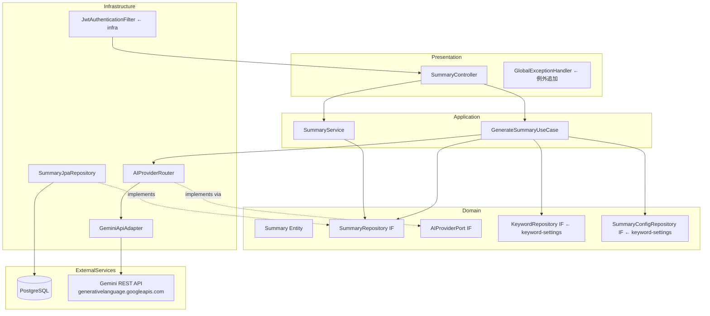
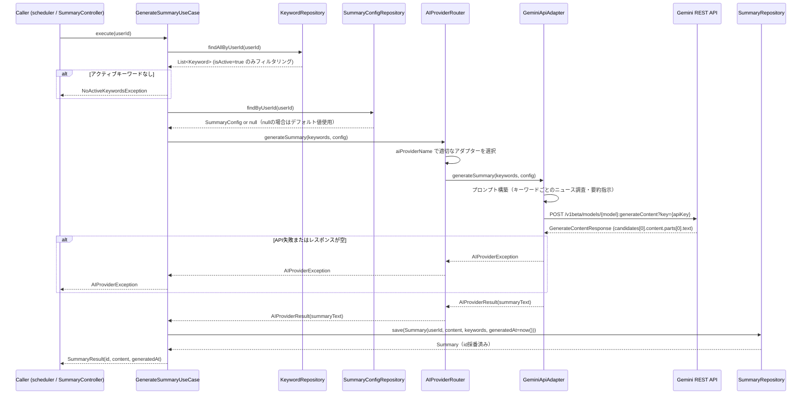
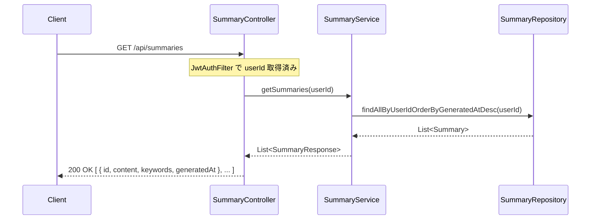

# 設計書: ai-summary-engine

## 概要

本スペックは、ニュース要約配信アプリケーション（News-Summary-R）の**AIニュース要約エンジン**を実装する。認証済みユーザーが登録したキーワードを基に、Gemini REST API の Google Search Grounding 機能を活用してリアルタイムにニュースを調査・要約し、結果を `Summary` エンティティとして PostgreSQL に永続化する。

**対象ユーザー**: JWT認証済みのアプリケーションエンドユーザー（APIを通じた要約取得）、および `scheduler` スペックのバッチ実行（`GenerateSummaryUseCase` の呼び出し元）。

**影響範囲**: `keyword-settings` スペックで確立した `Keyword`・`SummaryConfig` エンティティおよびリポジトリを上流依存とし、新たに `AIProviderPort` 出力ポート・`GeminiApiAdapter`・`GenerateSummaryUseCase`・`Summary` 集約・`SummaryController` を DDD 4層パッケージ構造に追加する。

### ゴール

- `AIProviderPort` 出力ポートインターフェースを定義し、将来の複数プロバイダー切り替えを設計上サポートする
- `GeminiApiAdapter`（Gemini REST API + Google Search Grounding）を実装し、キーワードに基づくリアルタイムニュース要約を生成する
- `GenerateSummaryUseCase` でキーワード取得→AI呼出→Summary永続化のオーケストレーションを実装する
- `Summary` エンティティとリポジトリを提供し、`notification-delivery` スペックが読み取れる状態を確立する
- `GET /api/summaries`・`POST /api/summaries/generate` エンドポイントを公開する

### 非ゴール

- スケジューリング（`scheduler` スペックが担当）
- 通知配信・メール送信（`notification-delivery` スペックが担当）
- プロバイダー管理画面・追加削除UI（`keyword-settings` の設定フォームが担当）
- ニュースソースの直接取得（AIのGrounding検索に委ねる）
- テストコード（プロジェクトポリシーによりスコープ外）
- DBマイグレーションツール（`ddl-auto=update` で代替）

---

## 境界コミットメント（Boundary Commitments）

### このスペックが所有するもの

- `AIProviderPort` ドメイン出力ポートインターフェース（プロバイダー抽象化の境界）
- `GeminiApiAdapter` インフラアダプター（Gemini REST API + Google Search Grounding実装）
- `AIProviderRouter`（`SummaryConfig.aiProviderName` によるアダプタールーティング）
- `GenerateSummaryUseCase` アプリケーションサービス（キーワード取得→AI呼出→Summary永続化）
- `Summary` ドメインエンティティ（id, userId, content, keywords, generatedAt）と `SummaryRepository` インターフェース
- `SummaryJpaRepository` インフラ実装
- `SummaryController` REST APIエンドポイント（`GET /api/summaries`・`POST /api/summaries/generate`）
- `SummaryService` アプリケーションサービス（一覧取得ユースケース）
- カスタム例外クラス（`AIProviderException`・`UnsupportedAIProviderException`・`NoActiveKeywordsException`）

### 境界外（このスペックが所有しないもの）

- `Keyword`・`SummaryConfig` エンティティおよびリポジトリ（`keyword-settings` スペックが所有）
- `User` エンティティ・JWT認証フィルター・SecurityConfig（`infrastructure` スペックが所有）
- スケジューリングロジック・ジョブ履歴（`scheduler` スペックが担当）
- Email配信・Webダッシュボード画面（`notification-delivery` スペックが担当）
- Gemini API キーの発行・管理（インフラ運用の責務）

### 許可された依存

- `infrastructure` スペック提供: `User`（id: Long）、`JwtAuthenticationFilter`・`SecurityConfig`・`GlobalExceptionHandler`
- `keyword-settings` スペック提供: `Keyword`・`KeywordRepository`・`SummaryConfig`・`SummaryConfigRepository`
- Spring Boot 3.x / Spring `RestClient`（外部AI SDKは使用しない）
- Spring Data JPA（blocking JPA のみ）
- PostgreSQL（Docker Compose経由）

### 再検証トリガー

- `Summary` エンティティの属性・ID型を変更した場合、`notification-delivery` は読み取りモデルを再検証すること
- `GenerateSummaryUseCase` のインターフェース（引数・戻り値）を変更した場合、`scheduler` は呼び出しコードを再検証すること
- `AIProviderPort` のインターフェースを変更した場合、すべての実装アダプターを再検証すること
- `SummaryRepository` のインターフェースを変更した場合、`notification-delivery` を再検証すること
- Gemini API のバージョンアップによりリクエスト/レスポンス形式が変更された場合、`GeminiApiAdapter` を再検証すること

---

## アーキテクチャ

### DDD 4層パッケージ構造への追加

本スペックは `keyword-settings` スペックが確立したパッケージ構造に、以下のパッケージを追加する。

```
com.newssummary
├── domain/
│   ├── user/                       # ← infrastructure スペック（変更なし）
│   ├── keyword/                    # ← keyword-settings スペック（変更なし）
│   ├── summaryconfig/              # ← keyword-settings スペック（変更なし）
│   ├── summary/                    # ← 本スペックで追加
│   │   ├── Summary.kt              # Summary JPA エンティティ兼ドメインモデル
│   │   ├── SummaryRepository.kt    # リポジトリインターフェース（ドメイン層）
│   │   └── AIProviderPort.kt       # AI呼び出し出力ポート（ドメイン層）
├── application/
│   ├── auth/                       # ← infrastructure スペック（変更なし）
│   ├── keyword/                    # ← keyword-settings スペック（変更なし）
│   ├── summaryconfig/              # ← keyword-settings スペック（変更なし）
│   └── summary/                    # ← 本スペックで追加
│       ├── GenerateSummaryUseCase.kt  # キーワード取得→AI呼出→Summary永続化
│       ├── SummaryService.kt          # Summary一覧取得ユースケース
│       └── dto/
│           ├── SummaryResult.kt       # GenerateSummaryUseCaseの戻り値DTO
│           └── SummaryResponse.kt     # REST APIレスポンスDTO
├── infrastructure/
│   ├── persistence/
│   │   ├── UserJpaRepository.kt    # ← infrastructure スペック（変更なし）
│   │   ├── KeywordJpaRepository.kt # ← keyword-settings スペック（変更なし）
│   │   ├── SummaryConfigJpaRepository.kt # ← keyword-settings スペック（変更なし）
│   │   └── SummaryJpaRepository.kt # ← 本スペックで追加（SummaryRepository の JPA 実装）
│   ├── ai/                         # ← 本スペックで追加
│   │   ├── GeminiApiAdapter.kt        # AIProviderPort の Gemini REST API 実装
│   │   └── AIProviderRouter.kt        # aiProviderName によるルーティング
│   ├── redis/                      # ← infrastructure スペック（変更なし）
│   └── security/                   # ← infrastructure スペック（変更なし）
└── presentation/
    ├── AuthController.kt           # ← infrastructure スペック（変更なし）
    ├── KeywordController.kt        # ← keyword-settings スペック（変更なし）
    ├── SummaryConfigController.kt  # ← keyword-settings スペック（変更なし）
    ├── GlobalExceptionHandler.kt   # ← 本スペックで例外追加のみ
    └── SummaryController.kt        # ← 本スペックで追加
```

### アーキテクチャパターン・境界マップ



**依存方向**: Presentation → Application → Domain ← Infrastructure（依存性逆転を維持）

`AIProviderPort` はドメイン層に定義し、`GeminiApiAdapter` はインフラ層に実装する。`AIProviderRouter` はインフラ層でアダプターを保持し、`AIProviderPort` インターフェースを通じてアプリケーション層から呼ばれる。

### テクノロジースタック

| レイヤー | 選択 / バージョン | 役割 | 備考 |
|---------|------------------|------|------|
| AIプロバイダー | Gemini REST API（generativelanguage.googleapis.com） | Gemini API呼び出し・Google Search Grounding | Spring RestClient で直呼び出し、APIキー認証 |
| バックエンド | Kotlin + Spring Boot 3.x | REST API・ユースケース・アダプター | Spring Security 6.x (infra継承) |
| ORM | Spring Data JPA / Hibernate | Summary永続化 | blocking JPA のみ（R2DBC禁止）|
| データストア | PostgreSQL 15 | Summary保存 | ddl-auto=update |
| コンテナ | Docker Compose v2 | 開発環境 | `GEMINI_API_KEY` を環境変数で注入 |

---

## ファイル構造計画

### ディレクトリ構造

```
backend/src/main/kotlin/com/newssummary/
├── domain/
│   └── summary/
│       ├── Summary.kt                        # Summary JPA エンティティ兼ドメインモデル
│       ├── SummaryRepository.kt              # ドメイン層リポジトリIF
│       └── AIProviderPort.kt                 # AI呼び出し出力ポートIF（ドメイン層）
├── application/
│   └── summary/
│       ├── GenerateSummaryUseCase.kt         # キーワード取得→AI呼出→Summary永続化オーケストレーター
│       ├── SummaryService.kt                 # Summary一覧取得ユースケース
│       └── dto/
│           ├── SummaryResult.kt              # GenerateSummaryUseCaseの戻り値（id, content, generatedAt）
│           └── SummaryResponse.kt            # REST APIレスポンスDTO
├── infrastructure/
│   ├── persistence/
│   │   └── SummaryJpaRepository.kt           # SummaryRepository の JPA 実装
│   └── ai/
│       ├── GeminiApiAdapter.kt               # AIProviderPort の Gemini REST API 実装
│       └── AIProviderRouter.kt               # aiProviderName でアダプターをルーティング
└── presentation/
    └── SummaryController.kt                  # /api/summaries エンドポイント

backend/src/main/resources/
└── application.yml                           # gemini.api-key, gemini.api-url, gemini.model-name を設定済み
```

### 修正対象ファイル

- `backend/src/main/kotlin/com/newssummary/presentation/GlobalExceptionHandler.kt` — `AIProviderException`（→502）・`UnsupportedAIProviderException`（→400）・`NoActiveKeywordsException`（→422）の例外ハンドラを追加
- `backend/src/main/resources/application.yml` — `gemini.api-key`・`gemini.api-url`・`gemini.model-name` 設定を追加

---

## システムフロー

### ニュース要約生成フロー（GenerateSummaryUseCase）



### 要約一覧取得フロー



---

## 要件トレーサビリティ

| 要件 | 概要 | コンポーネント | インターフェース | フロー |
|------|------|--------------|----------------|--------|
| 1.1–1.5 | AIProviderPort定義・ルーティング | AIProviderPort, AIProviderRouter | — | 要約生成フロー |
| 2.1–2.7 | GeminiApiAdapter実装 | GeminiApiAdapter | AIProviderPort | 要約生成フロー |
| 3.1–3.7 | GenerateSummaryUseCase | GenerateSummaryUseCase, AIProviderRouter | — | 要約生成フロー |
| 4.1–4.5 | Summaryエンティティ・永続化 | Summary, SummaryRepository, SummaryJpaRepository | — | — |
| 5.1–5.7 | SummaryController REST API | SummaryController, SummaryService | GET/POST /api/summaries | 一覧取得フロー |
| 6.1–6.4 | エラーハンドリング・設定 | GlobalExceptionHandler, GeminiApiAdapter, application.yml | — | — |

---

## コンポーネントとインターフェース

### コンポーネントサマリー

| コンポーネント | 層 | 意図 | 要件カバレッジ | 主要依存 |
|---|---|---|---|---|
| Summary | ドメイン | Summaryエンティティ | 4.1–4.5 | — |
| SummaryRepository | ドメイン | リポジトリIF | 4.1–4.5 | — |
| AIProviderPort | ドメイン | AI呼び出し出力ポートIF | 1.1–1.5 | — |
| GenerateSummaryUseCase | アプリケーション | 要約生成オーケストレーター | 3.1–3.7 | KeywordRepository, SummaryConfigRepository, AIProviderRouter, SummaryRepository |
| SummaryService | アプリケーション | Summary一覧取得ユースケース | 5.1–5.4 | SummaryRepository |
| SummaryJpaRepository | インフラ/永続化 | SummaryRepository JPA実装 | 4.3–4.5 | Spring Data JPA |
| GeminiApiAdapter | インフラ/AI | Gemini REST API実装 | 2.1–2.7 | Spring RestClient |
| AIProviderRouter | インフラ/AI | プロバイダールーティング | 1.2–1.4 | GeminiApiAdapter |
| SummaryController | プレゼンテーション | /api/summaries エンドポイント | 5.1–5.7 | GenerateSummaryUseCase, SummaryService |

---

### ドメイン層

#### Summary エンティティ

| フィールド | 詳細 |
|---|---|
| 意図 | ニュース要約を表すJPAエンティティ兼ドメインモデル。`notification-delivery`スペックが読み取る集約ルート |
| 要件 | 4.1, 4.2, 4.3 |

**責務と制約**
- 属性: `id: Long`（自動採番）、`userId: Long`（User.idへの論理参照）、`content: String`（要約テキスト、TEXT型）、`keywords: String`（使用キーワードのカンマ区切りリスト）、`generatedAt: Instant`
- kotlin-jpaプラグインによりno-argコンストラクタを自動生成（`@Entity`アノテーション）
- `content`は`@Column(columnDefinition = "TEXT")`でTEXT型にマッピング

##### ドメインモデル

```kotlin
@Entity
@Table(name = "summaries")
class Summary(
    @Id @GeneratedValue(strategy = GenerationType.IDENTITY)
    val id: Long = 0,
    @Column(name = "user_id", nullable = false)
    val userId: Long,
    @Column(nullable = false, columnDefinition = "TEXT")
    val content: String,
    @Column(nullable = false)
    val keywords: String,
    @Column(name = "generated_at", nullable = false)
    val generatedAt: Instant = Instant.now()
)
```

#### SummaryRepository インターフェース

```kotlin
interface SummaryRepository {
    fun save(summary: Summary): Summary
    fun findById(id: Long): Summary?
    fun findAllByUserIdOrderByGeneratedAtDesc(userId: Long): List<Summary>
}
```

#### AIProviderPort インターフェース

```kotlin
interface AIProviderPort {
    fun generateSummary(keywords: List<String>, config: SummaryConfig): AIProviderResult
}

data class AIProviderResult(val summaryText: String)
```

- 事前条件: `keywords`が非空リスト
- 事後条件: 要約テキストを含む`AIProviderResult`を返す
- 例外: AI呼び出し失敗時は`AIProviderException`をスロー

---

### アプリケーション層

#### GenerateSummaryUseCase

```kotlin
@Service
class GenerateSummaryUseCase(
    private val keywordRepository: KeywordRepository,
    private val summaryConfigRepository: SummaryConfigRepository,
    private val aiProviderPort: AIProviderPort,
    private val summaryRepository: SummaryRepository
) {
    fun execute(userId: Long): SummaryResult
}
```

**実装ノート**
- `KeywordRepository.findAllByUserId(userId)` で取得後、`isActive == true` のものだけをフィルタリングしてAIに渡す
- `SummaryConfig` が存在しない場合（`findByUserId` が null を返す）、デフォルト値を持つ `SummaryConfig` インスタンスを生成して使用する
- `keywords` フィールドへの保存形式はカンマ区切り文字列（例: `"S&P,日経225,戦争"`）

---

### インフラ/AI層

#### GeminiApiAdapter

| フィールド | 詳細 |
|---|---|
| 意図 | `AIProviderPort` の Gemini REST API 実装。Google Search Grounding を有効化してリアルタイムニュース要約を生成する |
| 要件 | 2.1–2.7 |

**コントラクト**

```kotlin
@Component
class GeminiApiAdapter(
    @Value("\${gemini.api-key}") private val apiKey: String,
    @Value("\${gemini.api-url:https://generativelanguage.googleapis.com/v1beta}") private val apiUrl: String,
    @Value("\${gemini.model-name:gemini-1.5-pro}") private val modelName: String
) : AIProviderPort {
    override fun generateSummary(keywords: List<String>, config: SummaryConfig): AIProviderResult
}
```

**実装ノート**
- Spring `RestClient` を使用して `$apiUrl/models/$modelName:generateContent?key=$apiKey` に POST
- Google Search Grounding は `tools: [{"googleSearch": {}}]` をリクエストボディに含めることで有効化
- レスポンスから `candidates[0].content.parts[0].text` でテキストを抽出
- candidates が空または text が空の場合は `AIProviderException("Empty response from Gemini")` をスロー
- ネットワークエラー・APIエラーは `catch` して `AIProviderException` にラップしてスロー

#### AIProviderRouter

```kotlin
@Component
class AIProviderRouter(
    private val geminiAdapter: GeminiApiAdapter
) : AIProviderPort {
    override fun generateSummary(keywords: List<String>, config: SummaryConfig): AIProviderResult {
        return when (config.aiProviderName) {
            "gemini" -> geminiAdapter.generateSummary(keywords, config)
            else -> throw UnsupportedAIProviderException(config.aiProviderName)
        }
    }
}
```

---

## データモデル

### 物理データモデル

```sql
CREATE TABLE summaries (
    id             BIGSERIAL PRIMARY KEY,
    user_id        BIGINT NOT NULL,
    content        TEXT NOT NULL,
    keywords       VARCHAR(1000) NOT NULL,
    generated_at   TIMESTAMPTZ NOT NULL DEFAULT NOW()
);

CREATE INDEX idx_summaries_user_id_generated_at ON summaries(user_id, generated_at DESC);
```

### application.yml 設定

```yaml
gemini:
  api-key: ${GEMINI_API_KEY:}
  api-url: ${GEMINI_API_URL:https://generativelanguage.googleapis.com/v1beta}
  model-name: ${GEMINI_MODEL_NAME:gemini-1.5-pro}
```

---

## エラーハンドリング

### カスタム例外クラス

```kotlin
class AIProviderException(message: String, cause: Throwable? = null) : RuntimeException(message, cause)
class UnsupportedAIProviderException(providerName: String) : RuntimeException("Unsupported AI provider: $providerName")
class NoActiveKeywordsException(userId: Long) : RuntimeException("No active keywords found for user: $userId")
```

### エラーカテゴリとレスポンス

- **ユーザーエラー (4xx)**:
  - 認証未済 → 401（JwtAuthenticationFilter、infraスペックが処理）
  - 不明なプロバイダー名 → 400（`UnsupportedAIProviderException`）
  - アクティブキーワードなし → 422（`NoActiveKeywordsException`）
- **外部サービスエラー (5xx)**:
  - Gemini API 失敗 → 502（`AIProviderException`）— 詳細はERRORログに記録
  - DB接続失敗 → 500（infraの`GlobalExceptionHandler`が処理）

---

## セキュリティ考慮事項

- Gemini API キーは `GEMINI_API_KEY` 環境変数から注入（コードにハードコードしない）
- 全 `/api/summaries` エンドポイントは `SecurityConfig` の `permitAll` リストから除外し、JWT認証を必須とする
- `userId` は JWT クレームから取得し、リクエストボディやパスパラメーターからの取得を禁止（改ざん防止）
- `content`（要約テキスト）は TEXT 型で保存するが、APIレスポンスへの出力時はエスケープ処理を Spring MVC に委ねる
