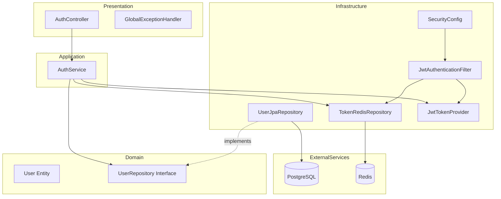
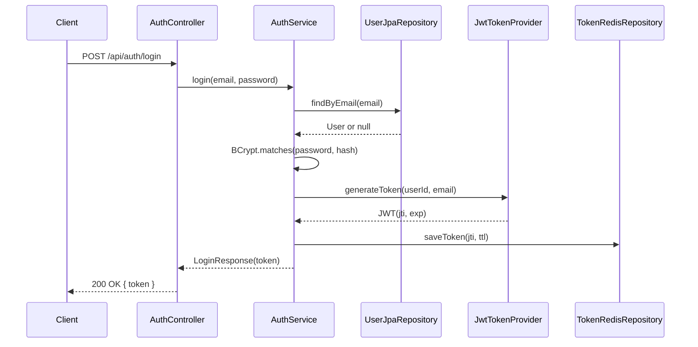
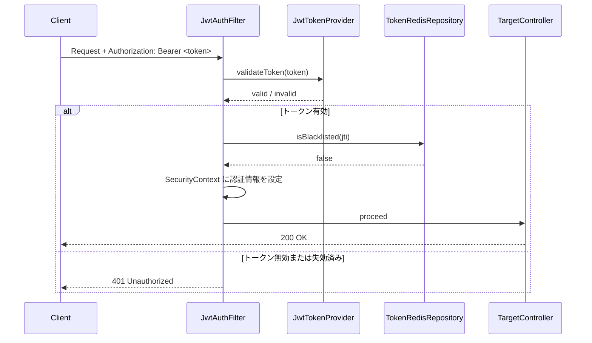

# 設計書: infrastructure

## 概要

本スペックは、ニュース要約配信アプリケーション（News-Summary-R）の**共通インフラ基盤**を構築する。`docker compose up` 一コマンドで PostgreSQL・Redis・Spring Boot・React の全サービスが起動し、JWT 認証付き REST API と React 画面が疎通できる状態を実現する。

後続4スペック（keyword-settings / ai-summary-engine / scheduler / notification-delivery）のすべてがこの基盤に依存する。DDD + クリーンアーキテクチャの4層パッケージ構造、JWT認証（ブラックリスト方式）、Userエンティティ・リポジトリを確立し、開発の共通土台とする。

**ユーザー**: 開発者（環境起動・後続スペック実装）および将来のエンドユーザー（認証機能の利用）。

### ゴール

- `docker compose up` で全サービスが起動し、Spring Boot 8080 / React 3000 で疎通できる
- DDD 4層パッケージ（domain / application / infrastructure / presentation）のスキャフォールドを確立する
- Spring Security 6.x + JJWT による JWT 認証（ログイン・検証・ログアウト）を実装する
- Redis によるトークン TTL 管理・ブラックリスト方式のログアウトを実装する
- User エンティティ・UserRepository を提供し、後続スペックの依存対象とする

### 非ゴール

- Flyway 等による DB マイグレーション管理（`ddl-auto=update` で代替）
- テストコード・CI/CD・本番環境設定
- ビジネスロジック（キーワード管理・AI要約・スケジューラー等）
- 画面コンポーネント（ルーティング設定のみ）
- LINE / Discord 通知・課金・マルチテナント

---

## 境界コミットメント（Boundary Commitments）

### このスペックが所有するもの

- Docker Compose マニフェスト（`docker-compose.yml`）と全サービス定義
- Spring Boot アプリケーションの `build.gradle.kts`・Kotlin プラグイン設定・`application.yml`
- DDD 4層パッケージ構造のスキャフォールド
- `User` ドメインエンティティ（ID・メール・パスワードハッシュ）と `UserRepository` インターフェース
- JWT 発行・検証・ブラックリスト管理ロジック（`JwtTokenProvider`・`JwtAuthenticationFilter`）
- Redis へのトークン保存（TTL 設定・ブラックリスト登録）
- Spring Security 設定（`SecurityConfig`）
- 認証エンドポイント（`/api/auth/login`・`/api/auth/register`・`/api/auth/logout`）
- グローバル例外ハンドラ（`GlobalExceptionHandler`）
- React + Tailwind CSS スキャフォールド・基本ルーティング設定

### 境界外（このスペックが所有しないもの）

- キーワード・スケジュール・要約・通知に関するドメインロジック
- 画面コンポーネントの実装（ルーティングのみ）
- DB マイグレーション管理ツール
- メール送信・AI 呼び出し・スケジューラー

### 許可された依存

- PostgreSQL（Docker コンテナ・Spring Data JPA 経由）
- Redis（Docker コンテナ・Spring Data Redis / Lettuce 経由）
- JJWT ライブラリ（JWT 操作）
- Spring Boot 3.x / Spring Security 6.x

### 再検証トリガー

- `User` エンティティの属性・ID 型を変更した場合、後続スペックはモデル依存箇所を再確認すること
- JWT クレーム構造（フィールド名・型）を変更した場合、トークン検証ロジックを利用する全スペックが影響を受ける
- `UserRepository` のインターフェースを変更した場合、すべての利用スペックを再検証すること
- Docker Compose のサービス名・ポートを変更した場合、環境変数設定が影響を受ける

---

## アーキテクチャ

### DDD 4層パッケージ構造

```
com.newssummary
├── domain/                  # ドメイン層：エンティティ・値オブジェクト・リポジトリIF
│   └── user/
│       ├── User.kt
│       └── UserRepository.kt
├── application/             # アプリケーション層：ユースケース・サービス
│   └── auth/
│       ├── AuthService.kt
│       └── dto/
├── infrastructure/          # インフラ層：JPA実装・Redis・外部サービスアダプタ
│   ├── persistence/
│   │   └── UserJpaRepository.kt
│   ├── redis/
│   │   └── TokenRedisRepository.kt
│   └── security/
│       ├── JwtTokenProvider.kt
│       └── JwtAuthenticationFilter.kt
└── presentation/            # プレゼンテーション層：REST コントローラー
    ├── AuthController.kt
    └── GlobalExceptionHandler.kt
```

### アーキテクチャパターン・境界マップ



**依存方向**: Presentation → Application → Domain ← Infrastructure（依存性逆転）

### テクノロジースタック

| レイヤー | 選択 / バージョン | 役割 | 備考 |
|---------|------------------|------|------|
| フロントエンド | React 18 + Vite + Tailwind CSS 3.x | SPA スキャフォールド・ルーティング | React Router v6 |
| バックエンド | Kotlin + Spring Boot 3.x | REST API・認証・ビジネスロジック基盤 | Spring Security 6.x |
| ORM | Spring Data JPA / Hibernate | エンティティ永続化・スキーマ自動生成 | blocking JPA のみ（R2DBC 禁止）|
| JWT | JJWT（io.jsonwebtoken）0.12.x | JWT 発行・署名・検証 | HS256 アルゴリズム |
| キャッシュ/トークン管理 | Spring Data Redis / Lettuce | トークン TTL・ブラックリスト管理 | |
| データストア | PostgreSQL 15 | ユーザーデータ永続化 | |
| セッションストア | Redis 7.x | JWT ブラックリスト・TTL 管理 | |
| コンテナ | Docker Compose v2 | 開発環境オーケストレーション | |

---

## ファイル構造計画

### ディレクトリ構造

```
News-Summary-R/
├── docker-compose.yml
├── .env.example
├── backend/
│   ├── build.gradle.kts
│   ├── settings.gradle.kts
│   ├── Dockerfile
│   └── src/main/
│       ├── kotlin/com/newssummary/
│       │   ├── NewsSummaryApplication.kt         # Spring Boot エントリポイント
│       │   ├── domain/
│       │   │   └── user/
│       │   │       ├── User.kt                   # User エンティティ（JPA + ドメインモデル）
│       │   │       └── UserRepository.kt         # リポジトリインターフェース（ドメイン層）
│       │   ├── application/
│       │   │   └── auth/
│       │   │       ├── AuthService.kt            # 認証ユースケース（ログイン・登録・ログアウト）
│       │   │       └── dto/
│       │   │           ├── LoginRequest.kt
│       │   │           ├── LoginResponse.kt
│       │   │           └── RegisterRequest.kt
│       │   ├── infrastructure/
│       │   │   ├── persistence/
│       │   │   │   └── UserJpaRepository.kt      # UserRepository の JPA 実装
│       │   │   ├── redis/
│       │   │   │   └── TokenRedisRepository.kt   # Redis トークン管理
│       │   │   └── security/
│       │   │       ├── JwtTokenProvider.kt       # JWT 生成・検証・JTI 抽出
│       │   │       ├── JwtAuthenticationFilter.kt # リクエスト毎の JWT 検証フィルター
│       │   │       └── SecurityConfig.kt         # Spring Security 設定
│       │   └── presentation/
│       │       ├── AuthController.kt             # /api/auth/* エンドポイント
│       │       └── GlobalExceptionHandler.kt     # @RestControllerAdvice
│       └── resources/
│           └── application.yml                   # DB・Redis・JWT・JPA 設定
│   └── test/
│       ├── kotlin/com/newssummary/
│       │   ├── infrastructure/security/
│       │   │   └── JwtTokenProviderTest.kt       # ユニットテスト（JUnit 5 + Mockito）
│       │   ├── application/auth/
│       │   │   └── AuthServiceTest.kt            # ユニットテスト（JUnit 5 + Mockito）
│       │   └── presentation/
│       │       ├── AuthControllerIntegrationTest.kt  # 統合テスト（TestContainers）
│       │       └── AuthFlowIntegrationTest.kt        # JWT認証フロー統合テスト（TestContainers）
│       └── resources/
│           └── application-test.yml              # テスト用設定（TestContainers 上書き用）
└── frontend/
    ├── Dockerfile
    ├── package.json
    ├── vite.config.ts
    ├── tailwind.config.ts
    ├── src/
    │   ├── main.tsx
    │   ├── App.tsx                               # ルーティング定義
    │   ├── api/
    │   │   └── axiosClient.ts                    # JWT自動付与・インターセプター設定
    │   └── pages/
    │       ├── LoginPage.tsx                     # ログインページ（スタブ）
    │       └── DashboardPage.tsx                 # ダッシュボードページ（スタブ）
    └── index.html
```

### 修正対象ファイル

新規プロジェクトのため修正対象なし。全ファイルを新規作成する。

---

## システムフロー

### ログインフロー



### JWT検証フロー（リクエスト毎）



---

## 要件トレーサビリティ

| 要件 | 概要 | コンポーネント | インターフェース | フロー |
|------|------|--------------|----------------|--------|
| 1.1–1.6 | Docker Compose 環境 | docker-compose.yml | — | — |
| 2.1–2.6 | Spring Boot スキャフォールド | build.gradle.kts, application.yml, NewsSummaryApplication | — | — |
| 3.1–3.5 | React + Tailwind スキャフォールド | App.tsx, axiosClient.ts, Dockerfile | — | — |
| 4.1–4.6 | JWT ログイン | AuthService, JwtTokenProvider, TokenRedisRepository | POST /api/auth/login | ログインフロー |
| 5.1–5.6 | JWT トークン検証 | JwtAuthenticationFilter, JwtTokenProvider, TokenRedisRepository | SecurityConfig | JWT検証フロー |
| 6.1–6.4 | JWT ログアウト | AuthService, TokenRedisRepository | POST /api/auth/logout | — |
| 7.1–7.5 | ユーザー登録 | AuthService, UserJpaRepository, User | POST /api/auth/register | — |
| 8.1–8.5 | グローバル例外ハンドラ | GlobalExceptionHandler | — | — |

---

## コンポーネントとインターフェース

### コンポーネントサマリー

| コンポーネント | 層 | 意図 | 要件カバレッジ | 主要依存 |
|---|---|---|---|---|
| docker-compose.yml | インフラ | 全サービス起動定義 | 1.1–1.6 | — |
| build.gradle.kts | インフラ | ビルド設定・Kotlin プラグイン | 2.1–2.5 | — |
| User | ドメイン | ユーザーエンティティ | 7.1–7.5 | — |
| UserRepository | ドメイン | リポジトリIF | 7.1–7.5 | — |
| AuthService | アプリケーション | 認証ユースケース | 4.1–4.6, 6.1–6.4, 7.1–7.5 | UserRepository, JwtTokenProvider, TokenRedisRepository |
| JwtTokenProvider | インフラ/セキュリティ | JWT 操作 | 4.1–4.5, 5.1–5.6 | JJWT |
| JwtAuthenticationFilter | インフラ/セキュリティ | リクエスト認証フィルター | 5.1–5.6 | JwtTokenProvider, TokenRedisRepository |
| SecurityConfig | インフラ/セキュリティ | Spring Security 設定 | 5.5 | JwtAuthenticationFilter |
| TokenRedisRepository | インフラ/Redis | トークン TTL・ブラックリスト | 4.2, 5.4, 6.1–6.2 | Spring Data Redis |
| UserJpaRepository | インフラ/永続化 | User JPA 実装 | 7.1–7.5 | Spring Data JPA |
| AuthController | プレゼンテーション | 認証エンドポイント | 4.1–4.6, 6.1–6.4, 7.1–7.5 | AuthService |
| GlobalExceptionHandler | プレゼンテーション | 統一エラーレスポンス | 8.1–8.5 | — |
| App.tsx | フロントエンド | ルーティング定義 | 3.1–3.4 | React Router |
| axiosClient.ts | フロントエンド | JWT付与HTTPクライアント | 3.5 | Axios |
| JwtTokenProviderTest | テスト/ユニット | JwtTokenProvider 単体検証 | 9.2 | JUnit 5, Mockito |
| AuthServiceTest | テスト/ユニット | AuthService 単体検証 | 9.3 | JUnit 5, Mockito |
| AuthControllerIntegrationTest | テスト/統合 | 認証エンドポイント統合検証 | 9.4 | JUnit 5, TestContainers |
| AuthFlowIntegrationTest | テスト/統合 | JWT認証フロー E2E 検証 | 9.4 | JUnit 5, TestContainers |

---

### インフラ層

#### docker-compose.yml

| フィールド | 詳細 |
|---|---|
| 意図 | PostgreSQL・Redis・Spring Boot・React の全サービスを定義し、依存関係・ヘルスチェックを設定する |
| 要件 | 1.1, 1.2, 1.3, 1.4, 1.5, 1.6 |

**責務と制約**
- PostgreSQL サービス: ポート5432、データボリューム永続化、ヘルスチェック（pg_isready）
- Redis サービス: ポート6379、ヘルスチェック（redis-cli ping）
- Spring Boot サービス: ポート8080、depends_on PostgreSQL・Redis（condition: service_healthy）
- React サービス: ポート3000、開発モード起動

**コントラクト**: なし（Docker Compose マニフェスト）

---

#### build.gradle.kts

| フィールド | 詳細 |
|---|---|
| 意図 | Spring Boot + Kotlin のビルド設定、kotlin-jpa・kotlin-spring プラグインの有効化 |
| 要件 | 2.1, 2.2, 2.3, 2.5 |

**責務と制約**
- `org.jetbrains.kotlin.plugin.jpa` プラグインにより JPA エンティティへの no-arg コンストラクタを自動生成
- `org.jetbrains.kotlin.plugin.spring` プラグインにより Spring 管理クラスへの allopen 適用
- 依存ライブラリ: `spring-boot-starter-web`, `spring-boot-starter-data-jpa`, `spring-boot-starter-data-redis`, `spring-boot-starter-security`, `jjwt-api`, `jjwt-impl`, `jjwt-jackson`, `postgresql`

---

### ドメイン層

#### User エンティティ

| フィールド | 詳細 |
|---|---|
| 意図 | ユーザーを表す JPA エンティティ兼ドメインモデル |
| 要件 | 7.1, 7.2, 7.4 |

**責務と制約**
- 属性: `id: Long`（自動採番）、`email: String`（UNIQUE NOT NULL）、`passwordHash: String`（BCrypt ハッシュ）、`createdAt: Instant`
- kotlin-jpa プラグインにより no-arg コンストラクタを自動生成（`@Entity` アノテーション）
- kotlin-spring プラグインにより allopen 適用

##### ドメインモデル

```kotlin
@Entity
@Table(name = "users")
class User(
    @Id @GeneratedValue(strategy = GenerationType.IDENTITY)
    val id: Long = 0,
    @Column(nullable = false, unique = true)
    val email: String,
    @Column(nullable = false)
    var passwordHash: String,
    @Column(nullable = false)
    val createdAt: Instant = Instant.now()
)
```

#### UserRepository インターフェース

| フィールド | 詳細 |
|---|---|
| 意図 | ドメイン層のリポジトリインターフェース（インフラ実装への依存逆転） |
| 要件 | 7.1, 7.3 |

##### サービスインターフェース

```kotlin
interface UserRepository {
    fun save(user: User): User
    fun findByEmail(email: String): User?
    fun existsByEmail(email: String): Boolean
}
```

---

### アプリケーション層

#### AuthService

| フィールド | 詳細 |
|---|---|
| 意図 | ログイン・登録・ログアウトのユースケースを実装するアプリケーションサービス |
| 要件 | 4.1–4.6, 6.1–6.4, 7.1–7.5 |

**依存**
- Inbound: AuthController — 認証リクエスト（P0）
- Outbound: UserRepository — ユーザー検索・保存（P0）
- Outbound: JwtTokenProvider — トークン生成（P0）
- Outbound: TokenRedisRepository — トークン保存・ブラックリスト（P0）

**コントラクト**: Service [x]

##### サービスインターフェース

```kotlin
interface AuthServiceInterface {
    fun login(request: LoginRequest): LoginResponse
    fun register(request: RegisterRequest): UserResponse
    fun logout(token: String): Unit
}
```

- 事前条件（login）: `email` が有効形式、`password` が非空
- 事後条件（login）: JWT が Redis に保存され、レスポンスにトークンが含まれる
- 事前条件（register）: `email` が未登録、`password` が最低8文字
- 事後条件（register）: User が PostgreSQL に保存される（BCrypt ハッシュ化済み）

---

### インフラ/セキュリティ層

#### JwtTokenProvider

| フィールド | 詳細 |
|---|---|
| 意図 | JWT の生成・署名・検証・クレーム抽出を担当 |
| 要件 | 4.1, 4.2, 4.4, 4.5, 5.1, 5.2, 5.3 |

**コントラクト**: Service [x]

##### サービスインターフェース

```kotlin
class JwtTokenProvider(
    private val jwtSecret: String,         // application.yml から注入
    private val jwtExpirationMs: Long      // デフォルト 86400000 (24h)
) {
    fun generateToken(userId: Long, email: String): TokenData
    fun validateToken(token: String): Boolean
    fun getJtiFromToken(token: String): String
    fun getUserIdFromToken(token: String): Long
    fun getRemainingTtl(token: String): Long   // ミリ秒
}

data class TokenData(val token: String, val jti: String, val expiresAt: Instant)
```

- JWT クレーム: `sub`（userId）、`email`、`jti`（UUID）、`iat`、`exp`
- アルゴリズム: HS256

#### JwtAuthenticationFilter

| フィールド | 詳細 |
|---|---|
| 意図 | 全リクエストに対して Authorization ヘッダーを検証し SecurityContext を設定する |
| 要件 | 5.1–5.6 |

**依存**
- Outbound: JwtTokenProvider — トークン検証（P0）
- Outbound: TokenRedisRepository — ブラックリスト確認（P0）

**コントラクト**: Service [x]

**実装ノート**
- `OncePerRequestFilter` を継承
- `Bearer ` プレフィックスを除いたトークン文字列を JwtTokenProvider に渡す
- ブラックリスト確認は Redis への同期アクセス（blocking）
- 認証失敗時は `response.sendError(401)` を呼び出し、フィルターチェーンを中断する

#### SecurityConfig

| フィールド | 詳細 |
|---|---|
| 意図 | Spring Security の HTTP セキュリティ設定（CSRF・CORS・パスマッチング・フィルター登録） |
| 要件 | 5.5 |

**実装ノート**
- CSRF 無効化（JWT ステートレス設定）
- `sessionManagement.sessionCreationPolicy(STATELESS)`
- permitAll パス: `/api/auth/login`・`/api/auth/register`
- `JwtAuthenticationFilter` を `UsernamePasswordAuthenticationFilter` の前に追加

---

#### TokenRedisRepository

| フィールド | 詳細 |
|---|---|
| 意図 | Redis を使った JWT のトークン TTL 管理とブラックリスト登録 |
| 要件 | 4.2, 5.4, 6.1, 6.2 |

**コントラクト**: Service [x]

##### サービスインターフェース

```kotlin
class TokenRedisRepository(
    private val redisTemplate: StringRedisTemplate
) {
    fun saveToken(jti: String, ttlMs: Long): Unit
    fun isBlacklisted(jti: String): Boolean
    fun addToBlacklist(jti: String, remainingTtlMs: Long): Unit
}
```

- Redis キー形式（有効トークン）: `token:{jti}`（値: "valid"）
- Redis キー形式（ブラックリスト）: `blacklist:{jti}`（値: "revoked"）
- TTL はトークン有効期限と同期

---

### インフラ/永続化層

#### UserJpaRepository

| フィールド | 詳細 |
|---|---|
| 意図 | UserRepository インターフェースの JPA 実装。Spring Data JPA の JpaRepository を内部で使用 |
| 要件 | 7.1, 7.3 |

**実装ノート**
- `UserRepository`（ドメイン）インターフェースを実装する Spring Component
- 内部に `SpringDataUserJpaRepository`（`JpaRepository<User, Long>` を extends する Spring Data インターフェース）を委譲パターンで保持

---

### プレゼンテーション層

#### AuthController

| フィールド | 詳細 |
|---|---|
| 意図 | ログイン・登録・ログアウトの REST エンドポイントを提供する |
| 要件 | 4.1, 4.6, 6.1, 6.4, 7.1, 7.2, 7.5 |

**コントラクト**: API [x]

##### API コントラクト

| メソッド | エンドポイント | リクエスト | レスポンス | エラー |
|---------|-------------|-----------|-----------|-------|
| POST | /api/auth/login | `LoginRequest` | `LoginResponse` | 400, 401, 500 |
| POST | /api/auth/register | `RegisterRequest` | `UserResponse` | 400, 409, 500 |
| POST | /api/auth/logout | （Authorization ヘッダー） | 200 OK | 401, 500 |

**DTO 定義**

```kotlin
data class LoginRequest(
    @field:NotBlank val email: String,
    @field:NotBlank val password: String
)

data class LoginResponse(val token: String, val email: String)

data class RegisterRequest(
    @field:Email val email: String,
    @field:Size(min = 8) val password: String
)

data class UserResponse(val id: Long, val email: String, val createdAt: Instant)
```

#### GlobalExceptionHandler

| フィールド | 詳細 |
|---|---|
| 意図 | `@RestControllerAdvice` によるアプリケーション全体の統一エラーレスポンス |
| 要件 | 8.1–8.5 |

**エラーレスポンス形式**

```kotlin
data class ErrorResponse(
    val timestamp: Instant,
    val status: Int,
    val error: String,
    val message: String
)
```

- `MethodArgumentNotValidException` → 400（フィールドエラーリストを含む）
- `EmailAlreadyExistsException` → 409
- `BadCredentialsException` / 認証エラー → 401
- `EntityNotFoundException` → 404
- その他の例外 → 500（詳細はログのみ、クライアントには "Internal Server Error" のみ返す）

---

## データモデル

### ドメインモデル

- 集約ルート: `User`（ID・email・passwordHash・createdAt）
- 不変条件: email は一意、passwordHash は BCrypt 形式
- ドメインイベント: 本スペックでは不使用（後続スペックで拡張可）

### 物理データモデル

```sql
CREATE TABLE users (
    id          BIGSERIAL PRIMARY KEY,
    email       VARCHAR(255) NOT NULL UNIQUE,
    password_hash VARCHAR(255) NOT NULL,
    created_at  TIMESTAMPTZ NOT NULL DEFAULT NOW()
);

CREATE UNIQUE INDEX idx_users_email ON users(email);
```

※ `ddl-auto=update` により JPA が自動生成する。明示的マイグレーションは本スペックのスコープ外。

### Redis データ構造

| キーパターン | 型 | TTL | 用途 |
|---|---|---|---|
| `token:{jti}` | String（"valid"） | JWT exp と同じ | 有効トークン管理 |
| `blacklist:{jti}` | String（"revoked"） | トークン残存 TTL | ログアウト済みトークン無効化 |

---

## エラーハンドリング

### エラー戦略

- 全例外は `GlobalExceptionHandler` で捕捉し、`ErrorResponse` 形式に統一する
- 認証エラー（401）は詳細を開示しない（ユーザー存在の有無を秘匿）
- バリデーションエラー（400）はフィールド名とメッセージを返す
- 500 エラーは内部詳細をログに記録し、クライアントには汎用メッセージのみ返す

### エラーカテゴリとレスポンス

- **ユーザーエラー (4xx)**: バリデーション失敗 → 400、認証失敗 → 401、重複登録 → 409
- **システムエラー (5xx)**: DB 接続失敗・Redis 接続失敗 → 500（graceful degradation なし、起動時に fail-fast）
- **セキュリティエラー**: トークン不正・期限切れ・ブラックリスト → 401（詳細なし）

---

## テスト戦略

テストコードは**本スペックの実装スコープに含まれる必須成果物**である。JUnit 5 を使用し、`src/test/kotlin` 以下に本番コードと同一のパッケージ構造で配置する。`./gradlew test` で全テストが通過することを完了条件とする。

### テスト依存ライブラリ（build.gradle.kts）

- `spring-boot-starter-test`（JUnit 5・MockMvc・AssertJ を含む）
- `testcontainers:postgresql`・`testcontainers:junit-jupiter`
- `org.testcontainers:redis`（または `com.redis.testcontainers:testcontainers-redis`）
- `mockito-kotlin`

### ユニットテスト

JUnit 5 + Mockito を使用し、外部依存をモック化して各クラスの単体動作を検証する。

| テスト対象 | テストクラス | 検証内容 |
|---|---|---|
| `JwtTokenProvider` | `JwtTokenProviderTest` | トークン生成（クレーム・exp 設定）、有効トークンの検証成功、改ざんトークンの検証失敗、期限切れトークンの検証失敗、JTI 抽出、残存 TTL 計算 |
| `AuthService` | `AuthServiceTest` | ログイン成功（JWT 発行・Redis 保存）、存在しないメールアドレスで 401、パスワード不一致で 401、ログアウト（ブラックリスト登録）、新規ユーザー登録成功、重複メールアドレスで例外 |

**アノテーション例**:
```kotlin
@ExtendWith(MockitoExtension::class)
class JwtTokenProviderTest {
    @Test
    fun `有効なトークンの検証が成功すること`() { ... }

    @Test
    fun `期限切れトークンの検証が失敗すること`() { ... }
}
```

### 統合テスト

JUnit 5 + `@SpringBootTest` + TestContainers を使用し、実際の PostgreSQL・Redis コンテナ上で API エンドポイントの動作を検証する。

| テスト対象 | テストクラス | 検証内容 |
|---|---|---|
| `AuthController` ログイン | `AuthControllerIntegrationTest` | 正しい資格情報で POST `/api/auth/login` → 200 + JWT 取得 |
| `AuthController` 認証失敗 | `AuthControllerIntegrationTest` | 誤パスワードで POST `/api/auth/login` → 401 |
| `AuthController` 登録 | `AuthControllerIntegrationTest` | POST `/api/auth/register` → 201 + UserResponse |
| `AuthController` 重複登録 | `AuthControllerIntegrationTest` | 同メールアドレスで2回 POST `/api/auth/register` → 409 |
| JWT 認証フロー | `AuthFlowIntegrationTest` | ログイン → JWT 取得 → 保護エンドポイント 200 → ログアウト → 同 JWT で 401 |
| `GlobalExceptionHandler` | `AuthControllerIntegrationTest` | バリデーションエラー → 400 + フィールドエラー詳細、500 エラー → スタックトレース非漏洩 |

**アノテーション例**:
```kotlin
@SpringBootTest(webEnvironment = SpringBootTest.WebEnvironment.RANDOM_PORT)
@Testcontainers
class AuthFlowIntegrationTest {
    @Container
    val postgres = PostgreSQLContainer("postgres:15")

    @Container
    val redis = GenericContainer("redis:7")

    @Test
    fun `ログアウト後に同一トークンで認証が拒否されること`() { ... }
}
```

---

## セキュリティ考慮事項

- JWT 秘密鍵は環境変数から注入（コードにハードコードしない）
- BCrypt ストレングス: デフォルト（コスト10）
- ブラックリスト方式によりログアウト後の即時無効化を保証（JWTのステートレス性の補完）
- Spring Security の CSRF 無効化は JWT ステートレス設計に基づく（セッション非使用）
- 認証失敗時のエラーメッセージは汎用化し、ユーザー列挙攻撃を防ぐ
- `ddl-auto=update` は開発環境専用設定。本番移行時は Flyway 等に切り替えること
