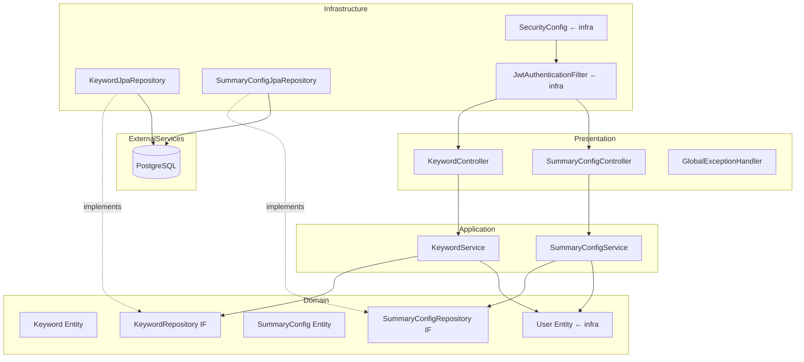
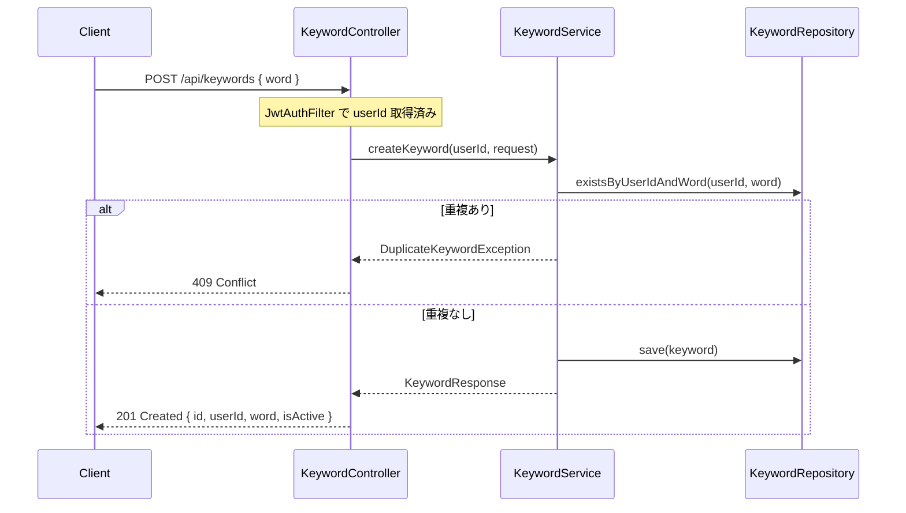
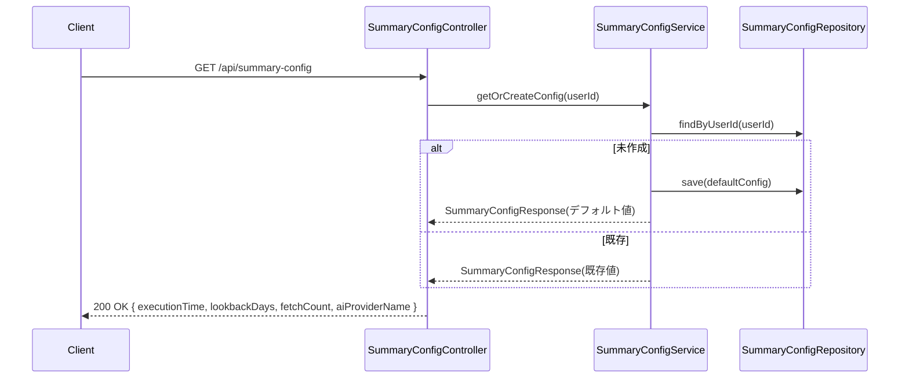

# 設計書: keyword-settings

## 概要

本スペックは、ニュース要約配信アプリケーション（News-Summary-R）の**キーワード設定・サマリー実行設定管理機能**を実装する。認証済みユーザーが管理画面からキーワードのCRUD操作とサマリー実行設定の変更を行え、設定がPostgreSQLに永続化される状態を実現する。

**対象ユーザー**: JWT認証済みのアプリケーションエンドユーザー。
**影響範囲**: `infrastructure` スペックで確立したDDD 4層パッケージ構造・JWT認証フィルター・Userエンティティを前提として、新たに `keyword` および `summaryconfig` の2つのドメイン集約とそのREST APIおよびReact管理画面を追加する。

### ゴール

- Keyword集約（id, userId, word, isActive）のCRUD API・永続化を実装する
- SummaryConfig集約（userId, executionTime, lookbackDays, fetchCount, aiProviderName）の取得・更新 API・永続化を実装する
- JWT認証による所有者チェックを全エンドポイントで適用する
- React管理画面（キーワード管理ページ・設定ページ）を実装する

### 非ゴール

- AI呼び出し・スケジューラー・通知配信の実装
- キーワードの有効性バリデーション（AIが判断）
- テストコード（プロジェクトポリシーによりスコープ外）
- DB マイグレーションツール（`ddl-auto=update` で代替）

---

## 境界コミットメント（Boundary Commitments）

### このスペックが所有するもの

- `Keyword` ドメインエンティティ（id, userId, word, isActive）と `KeywordRepository` インターフェース
- `SummaryConfig` ドメインエンティティ（userId, executionTime, lookbackDays, fetchCount, aiProviderName）と `SummaryConfigRepository` インターフェース
- `KeywordService`・`SummaryConfigService` アプリケーションサービス（ユースケース実装）
- `KeywordJpaRepository`・`SummaryConfigJpaRepository` インフラ実装
- REST API：`/api/keywords`（CRUD）・`/api/summary-config`（GET/PUT）
- React 管理画面：キーワード管理ページ・設定ページ

### 境界外（このスペックが所有しないもの）

- User エンティティ・JWT認証フィルター・SecurityConfig（`infrastructure` スペックが所有）
- AI呼び出し・スケジューラー・通知配信
- キーワード有効性チェック

### 許可された依存

- `infrastructure` スペックが提供する `User`（id: Long）・`UserRepository`・`JwtAuthenticationFilter`・`SecurityConfig`・`GlobalExceptionHandler`
- Spring Boot 3.x / Spring Data JPA（blocking JPA のみ）
- PostgreSQL（Docker Compose で提供）
- React + Axios + Tailwind CSS（`infrastructure` スペックが提供するスキャフォールド）

### 再検証トリガー

- `Keyword` または `SummaryConfig` のエンティティ属性を変更した場合、`ai-summary-engine`・`scheduler` は読み取りモデルを再検証すること
- `/api/keywords`・`/api/summary-config` のAPIシグネチャを変更した場合、React UIおよび後続スペックは再検証すること
- `SummaryConfig.executionTime` の型・フォーマットを変更した場合、`scheduler` は再検証すること

---

## アーキテクチャ

### DDD 4層パッケージ構造への追加

本スペックは `infrastructure` スペックが確立したパッケージ構造に、以下のパッケージを追加する。

```
com.newssummary
├── domain/
│   ├── user/                   # ← infrastructure スペック（変更なし）
│   ├── keyword/                # ← 本スペックで追加
│   │   ├── Keyword.kt
│   │   └── KeywordRepository.kt
│   └── summaryconfig/          # ← 本スペックで追加
│       ├── SummaryConfig.kt
│       └── SummaryConfigRepository.kt
├── application/
│   ├── auth/                   # ← infrastructure スペック（変更なし）
│   ├── keyword/                # ← 本スペックで追加
│   │   ├── KeywordService.kt
│   │   └── dto/
│   │       ├── CreateKeywordRequest.kt
│   │       ├── UpdateKeywordRequest.kt
│   │       └── KeywordResponse.kt
│   └── summaryconfig/          # ← 本スペックで追加
│       ├── SummaryConfigService.kt
│       └── dto/
│           ├── SummaryConfigRequest.kt
│           └── SummaryConfigResponse.kt
├── infrastructure/
│   ├── persistence/
│   │   ├── UserJpaRepository.kt      # ← infrastructure スペック（変更なし）
│   │   ├── KeywordJpaRepository.kt   # ← 本スペックで追加
│   │   └── SummaryConfigJpaRepository.kt # ← 本スペックで追加
│   ├── redis/                  # ← infrastructure スペック（変更なし）
│   └── security/               # ← infrastructure スペック（変更なし）
└── presentation/
    ├── AuthController.kt       # ← infrastructure スペック（変更なし）
    ├── GlobalExceptionHandler.kt # ← 本スペックで例外追加のみ（KeywordNotFoundException, DuplicateKeywordException, ForbiddenException）
    ├── KeywordController.kt    # ← 本スペックで追加
    └── SummaryConfigController.kt # ← 本スペックで追加
```

### アーキテクチャパターン・境界マップ



**依存方向**: Presentation → Application → Domain ← Infrastructure（依存性逆転を維持）

### テクノロジースタック

| レイヤー | 選択 / バージョン | 役割 | 備考 |
|---------|-----------------|------|------|
| フロントエンド | React 18 + Vite + Tailwind CSS 3.x | キーワード管理・設定フォームUI | React Router v6、Axios |
| バックエンド | Kotlin + Spring Boot 3.x | REST API・ビジネスロジック | Spring Security 6.x (infra 継承) |
| ORM | Spring Data JPA / Hibernate | Keyword・SummaryConfig 永続化 | blocking JPA のみ（R2DBC 禁止）|
| データストア | PostgreSQL 15 | Keyword・SummaryConfig データ | ddl-auto=update |

---

## ファイル構造計画

### ディレクトリ構造

```
backend/src/main/kotlin/com/newssummary/
├── domain/
│   ├── keyword/
│   │   ├── Keyword.kt                        # Keyword JPA エンティティ兼ドメインモデル
│   │   └── KeywordRepository.kt              # ドメイン層リポジトリIF
│   └── summaryconfig/
│       ├── SummaryConfig.kt                  # SummaryConfig JPA エンティティ兼ドメインモデル
│       └── SummaryConfigRepository.kt        # ドメイン層リポジトリIF
├── application/
│   ├── keyword/
│   │   ├── KeywordService.kt                 # Keyword CRUD ユースケース
│   │   └── dto/
│   │       ├── CreateKeywordRequest.kt
│   │       ├── UpdateKeywordRequest.kt
│   │       └── KeywordResponse.kt
│   └── summaryconfig/
│       ├── SummaryConfigService.kt           # SummaryConfig 取得・更新ユースケース
│       └── dto/
│           ├── SummaryConfigRequest.kt
│           └── SummaryConfigResponse.kt
├── infrastructure/
│   └── persistence/
│       ├── KeywordJpaRepository.kt           # KeywordRepository の JPA 実装
│       └── SummaryConfigJpaRepository.kt     # SummaryConfigRepository の JPA 実装
└── presentation/
    ├── KeywordController.kt                  # /api/keywords エンドポイント
    └── SummaryConfigController.kt            # /api/summary-config エンドポイント

frontend/src/
├── pages/
│   ├── KeywordsPage.tsx                      # キーワード管理ページ
│   └── SettingsPage.tsx                      # サマリー設定ページ
├── components/
│   ├── KeywordList.tsx                       # キーワード一覧コンポーネント
│   ├── KeywordAddForm.tsx                    # キーワード追加フォーム
│   └── SummaryConfigForm.tsx                 # サマリー設定フォーム
└── api/
    ├── keywordsApi.ts                        # Keyword REST API クライアント
    └── summaryConfigApi.ts                   # SummaryConfig REST API クライアント
```

### 修正対象ファイル

- `backend/src/main/kotlin/com/newssummary/presentation/GlobalExceptionHandler.kt` — `KeywordNotFoundException`・`DuplicateKeywordException`・`ForbiddenResourceException` の例外ハンドラを追加
- `frontend/src/App.tsx` — `/keywords` および `/settings` ルートを追加

---

## システムフロー

### キーワード追加フロー



### SummaryConfig 初回取得フロー（自動作成）



---

## 要件トレーサビリティ

| 要件 | 概要 | コンポーネント | インターフェース |
|------|------|--------------|----------------|
| 1.1 | キーワード作成 | KeywordService, KeywordController | POST /api/keywords |
| 1.2 | キーワード一覧取得 | KeywordService, KeywordController | GET /api/keywords |
| 1.3 | isActive 更新 | KeywordService, KeywordController | PATCH /api/keywords/{id} |
| 1.4 | キーワード削除 | KeywordService, KeywordController | DELETE /api/keywords/{id} |
| 1.5 | 他ユーザーリソース保護 | KeywordService | 403 Forbidden |
| 1.6 | 存在しないリソース | KeywordService | 404 Not Found |
| 1.7 | wordバリデーション | CreateKeywordRequest, GlobalExceptionHandler | 400 Bad Request |
| 1.8 | 重複word防止 | KeywordService | 409 Conflict |
| 2.1 | SummaryConfig取得 | SummaryConfigService, SummaryConfigController | GET /api/summary-config |
| 2.2 | SummaryConfig自動作成 | SummaryConfigService | GET /api/summary-config (初回) |
| 2.3 | SummaryConfig更新 | SummaryConfigService, SummaryConfigController | PUT /api/summary-config |
| 2.4–2.6 | SummaryConfigバリデーション | SummaryConfigRequest, GlobalExceptionHandler | 400 Bad Request |
| 3.1–3.4 | JWT認証・所有者チェック | JwtAuthFilter (infra), KeywordService, SummaryConfigService | 401/403 |
| 4.1–4.6 | キーワード管理画面 | KeywordsPage, KeywordList, KeywordAddForm, keywordsApi | React UI |
| 5.1–5.4 | サマリー設定画面 | SettingsPage, SummaryConfigForm, summaryConfigApi | React UI |

---

## コンポーネントとインターフェース

### コンポーネントサマリー

| コンポーネント | 層 | 意図 | 要件カバレッジ | 主要依存 |
|---|---|---|---|---|
| Keyword | ドメイン | Keywordエンティティ | 1.1–1.8 | — |
| KeywordRepository | ドメイン | リポジトリIF | 1.1–1.8 | — |
| SummaryConfig | ドメイン | SummaryConfigエンティティ | 2.1–2.6 | — |
| SummaryConfigRepository | ドメイン | リポジトリIF | 2.1–2.6 | — |
| KeywordService | アプリケーション | Keyword CRUDユースケース | 1.1–1.8, 3.3 | KeywordRepository |
| SummaryConfigService | アプリケーション | SummaryConfig取得・更新ユースケース | 2.1–2.6, 3.4 | SummaryConfigRepository |
| KeywordJpaRepository | インフラ | KeywordRepository JPA実装 | 1.1–1.8 | Spring Data JPA |
| SummaryConfigJpaRepository | インフラ | SummaryConfigRepository JPA実装 | 2.1–2.6 | Spring Data JPA |
| KeywordController | プレゼンテーション | /api/keywords エンドポイント | 1.1–1.8, 3.1–3.2 | KeywordService |
| SummaryConfigController | プレゼンテーション | /api/summary-config エンドポイント | 2.1–2.6, 3.1–3.2 | SummaryConfigService |
| KeywordsPage | フロントエンド | キーワード管理ページ | 4.1–4.6 | keywordsApi |
| SettingsPage | フロントエンド | サマリー設定ページ | 5.1–5.4 | summaryConfigApi |

---

### ドメイン層

#### Keyword エンティティ

| フィールド | 詳細 |
|---|---|
| 意図 | キーワードを表す JPA エンティティ兼ドメインモデル |
| 要件 | 1.1–1.8 |

**責務と制約**
- 属性: `id: Long`（自動採番）、`userId: Long`（User.id への論理参照）、`word: String`（NOT NULL）、`isActive: Boolean`（デフォルト true）
- `userId + word` に UNIQUE 制約（同一ユーザーによる重複word防止）
- kotlin-jpa プラグインにより no-arg コンストラクタを自動生成

##### ドメインモデル

```kotlin
@Entity
@Table(
    name = "keywords",
    uniqueConstraints = [UniqueConstraint(columnNames = ["user_id", "word"])]
)
class Keyword(
    @Id @GeneratedValue(strategy = GenerationType.IDENTITY)
    val id: Long = 0,
    @Column(name = "user_id", nullable = false)
    val userId: Long,
    @Column(nullable = false)
    val word: String,
    @Column(name = "is_active", nullable = false)
    var isActive: Boolean = true
)
```

#### KeywordRepository インターフェース

```kotlin
interface KeywordRepository {
    fun save(keyword: Keyword): Keyword
    fun findById(id: Long): Keyword?
    fun findAllByUserId(userId: Long): List<Keyword>
    fun existsByUserIdAndWord(userId: Long, word: String): Boolean
    fun deleteById(id: Long)
}
```

#### SummaryConfig エンティティ

| フィールド | 詳細 |
|---|---|
| 意図 | サマリー実行設定を表す JPA エンティティ兼ドメインモデル（ユーザー1人に対し1レコード） |
| 要件 | 2.1–2.6 |

**責務と制約**
- 属性: `id: Long`（自動採番）、`userId: Long`（UNIQUE NOT NULL）、`executionTime: String`（"HH:mm" 形式）、`lookbackDays: Int`（1–365）、`fetchCount: Int`（1–100）、`aiProviderName: String`
- `userId` に UNIQUE 制約（1ユーザー1設定）
- デフォルト値: executionTime="07:00", lookbackDays=1, fetchCount=10, aiProviderName="gemini"

##### ドメインモデル

```kotlin
@Entity
@Table(name = "summary_configs")
class SummaryConfig(
    @Id @GeneratedValue(strategy = GenerationType.IDENTITY)
    val id: Long = 0,
    @Column(name = "user_id", nullable = false, unique = true)
    val userId: Long,
    @Column(name = "execution_time", nullable = false)
    var executionTime: String = "07:00",
    @Column(name = "lookback_days", nullable = false)
    var lookbackDays: Int = 1,
    @Column(name = "fetch_count", nullable = false)
    var fetchCount: Int = 10,
    @Column(name = "ai_provider_name", nullable = false)
    var aiProviderName: String = "gemini"
)
```

#### SummaryConfigRepository インターフェース

```kotlin
interface SummaryConfigRepository {
    fun save(config: SummaryConfig): SummaryConfig
    fun findByUserId(userId: Long): SummaryConfig?
}
```

---

### アプリケーション層

#### KeywordService

| フィールド | 詳細 |
|---|---|
| 意図 | Keyword の CRUD ユースケースを実装するアプリケーションサービス |
| 要件 | 1.1–1.8, 3.3 |

**依存**
- Inbound: KeywordController — Keyword操作リクエスト（P0）
- Outbound: KeywordRepository — Keyword保存・検索・削除（P0）

**コントラクト**: Service [x]

##### サービスインターフェース

```kotlin
interface KeywordServiceInterface {
    fun createKeyword(userId: Long, request: CreateKeywordRequest): KeywordResponse
    fun getKeywords(userId: Long): List<KeywordResponse>
    fun updateKeyword(userId: Long, keywordId: Long, request: UpdateKeywordRequest): KeywordResponse
    fun deleteKeyword(userId: Long, keywordId: Long): Unit
}
```

- 事前条件（createKeyword）: `word` が非空、同一 userId + word の重複なし
- 事後条件（createKeyword）: Keyword が PostgreSQL に保存され、KeywordResponse が返される
- 事前条件（updateKeyword/deleteKeyword）: Keyword が存在し、userId と所有者が一致
- 所有者不一致時: `ForbiddenResourceException` をスロー（→ 403）
- 存在しない時: `KeywordNotFoundException` をスロー（→ 404）
- 重複時: `DuplicateKeywordException` をスロー（→ 409）

**DTO 定義**

```kotlin
data class CreateKeywordRequest(
    @field:NotBlank val word: String
)

data class UpdateKeywordRequest(
    @field:NotNull val isActive: Boolean
)

data class KeywordResponse(
    val id: Long,
    val userId: Long,
    val word: String,
    val isActive: Boolean
)
```

#### SummaryConfigService

| フィールド | 詳細 |
|---|---|
| 意図 | SummaryConfig の取得・更新ユースケースを実装するアプリケーションサービス |
| 要件 | 2.1–2.6, 3.4 |

**依存**
- Inbound: SummaryConfigController — SummaryConfig操作リクエスト（P0）
- Outbound: SummaryConfigRepository — SummaryConfig保存・検索（P0）

**コントラクト**: Service [x]

##### サービスインターフェース

```kotlin
interface SummaryConfigServiceInterface {
    fun getOrCreateConfig(userId: Long): SummaryConfigResponse
    fun updateConfig(userId: Long, request: SummaryConfigRequest): SummaryConfigResponse
}
```

- 事後条件（getOrCreateConfig）: SummaryConfigが存在しない場合はデフォルト値で新規作成して返す
- 事前条件（updateConfig）: バリデーション済みリクエスト

**DTO 定義**

```kotlin
data class SummaryConfigRequest(
    @field:NotBlank
    @field:Pattern(regexp = "^([01]\\d|2[0-3]):[0-5]\\d$")
    val executionTime: String,
    @field:Min(1) @field:Max(365)
    val lookbackDays: Int,
    @field:Min(1) @field:Max(100)
    val fetchCount: Int,
    @field:NotBlank
    val aiProviderName: String
)

data class SummaryConfigResponse(
    val userId: Long,
    val executionTime: String,
    val lookbackDays: Int,
    val fetchCount: Int,
    val aiProviderName: String
)
```

---

### インフラ/永続化層

#### KeywordJpaRepository

| フィールド | 詳細 |
|---|---|
| 意図 | KeywordRepository の JPA 実装。Spring Data JPA の JpaRepository を内部で使用 |
| 要件 | 1.1–1.8 |

**実装ノート**
- `KeywordRepository`（ドメイン）インターフェースを実装する Spring Component
- 内部に `SpringDataKeywordJpaRepository`（`JpaRepository<Keyword, Long>`）を委譲パターンで保持
- `findAllByUserId`・`existsByUserIdAndWord` は Spring Data のメソッド命名規約で自動生成

#### SummaryConfigJpaRepository

| フィールド | 詳細 |
|---|---|
| 意図 | SummaryConfigRepository の JPA 実装 |
| 要件 | 2.1–2.6 |

**実装ノート**
- `SummaryConfigRepository`（ドメイン）インターフェースを実装する Spring Component
- 内部に `SpringDataSummaryConfigJpaRepository`（`JpaRepository<SummaryConfig, Long>`）を委譲パターンで保持
- `findByUserId` は Spring Data のメソッド命名規約で自動生成

---

### プレゼンテーション層

#### KeywordController

| フィールド | 詳細 |
|---|---|
| 意図 | キーワードCRUDの REST エンドポイントを提供する |
| 要件 | 1.1–1.8, 3.1–3.2 |

**コントラクト**: API [x]

##### API コントラクト

| メソッド | エンドポイント | リクエスト | レスポンス | エラー |
|---------|-------------|-----------|-----------|-------|
| POST | /api/keywords | `CreateKeywordRequest` | `KeywordResponse` | 400, 401, 409, 500 |
| GET | /api/keywords | — | `List<KeywordResponse>` | 401, 500 |
| PATCH | /api/keywords/{id} | `UpdateKeywordRequest` | `KeywordResponse` | 400, 401, 403, 404, 500 |
| DELETE | /api/keywords/{id} | — | 204 No Content | 401, 403, 404, 500 |

**実装ノート**
- `@AuthenticationPrincipal` または SecurityContext から userId を取得し、サービスに渡す
- Spring Security の `JwtAuthenticationFilter`（infrastructure スペック提供）により全エンドポイントで認証が事前実施される

#### SummaryConfigController

| フィールド | 詳細 |
|---|---|
| 意図 | サマリー実行設定のREST エンドポイントを提供する |
| 要件 | 2.1–2.6, 3.1–3.2 |

**コントラクト**: API [x]

##### API コントラクト

| メソッド | エンドポイント | リクエスト | レスポンス | エラー |
|---------|-------------|-----------|-----------|-------|
| GET | /api/summary-config | — | `SummaryConfigResponse` | 401, 500 |
| PUT | /api/summary-config | `SummaryConfigRequest` | `SummaryConfigResponse` | 400, 401, 500 |

#### GlobalExceptionHandler（修正）

既存の `GlobalExceptionHandler` に以下の例外ハンドリングを追加する：

```kotlin
// 追加する例外ハンドラ
@ExceptionHandler(KeywordNotFoundException::class)  // → 404
@ExceptionHandler(DuplicateKeywordException::class)  // → 409
@ExceptionHandler(ForbiddenResourceException::class) // → 403
```

---

### フロントエンド

#### KeywordsPage

| フィールド | 詳細 |
|---|---|
| 意図 | キーワードの一覧表示・追加・有効化/無効化・削除を行うReactページ |
| 要件 | 4.1–4.6 |

**実装ノート**
- `keywordsApi.ts` を通じてバックエンドAPIと通信
- useState で keywords リストを管理
- 追加フォーム（`KeywordAddForm`）と一覧（`KeywordList`）を組み合わせる
- APIエラー時はエラーメッセージをUIに表示

#### SettingsPage

| フィールド | 詳細 |
|---|---|
| 意図 | SummaryConfigの取得・更新を行うReactページ |
| 要件 | 5.1–5.4 |

**実装ノート**
- ページ表示時に GET `/api/summary-config` を呼び出し、フォームにデフォルト表示
- フォーム送信時に PUT `/api/summary-config` を呼び出し
- バリデーションエラー（APIレスポンス or クライアントバリデーション）をフィールド単位で表示
- executionTime 入力は `<input type="time">` を使用

#### keywordsApi.ts

```typescript
export const keywordsApi = {
  getAll: (): Promise<KeywordResponse[]>
  create: (word: string): Promise<KeywordResponse>
  update: (id: number, isActive: boolean): Promise<KeywordResponse>
  remove: (id: number): Promise<void>
}
```

#### summaryConfigApi.ts

```typescript
export const summaryConfigApi = {
  get: (): Promise<SummaryConfigResponse>
  update: (config: SummaryConfigRequest): Promise<SummaryConfigResponse>
}
```

---

## データモデル

### ドメインモデル

- **Keyword集約**: `Keyword`（userId, word, isActive）。集約ルート = Keyword。不変条件: userId+word は一意。
- **SummaryConfig集約**: `SummaryConfig`（userId, executionTime, lookbackDays, fetchCount, aiProviderName）。集約ルート = SummaryConfig。不変条件: userId は一意（1ユーザー1設定）。

### 物理データモデル

```sql
CREATE TABLE keywords (
    id          BIGSERIAL PRIMARY KEY,
    user_id     BIGINT NOT NULL,
    word        VARCHAR(255) NOT NULL,
    is_active   BOOLEAN NOT NULL DEFAULT TRUE,
    CONSTRAINT uq_keyword_user_word UNIQUE (user_id, word)
);

CREATE INDEX idx_keywords_user_id ON keywords(user_id);

CREATE TABLE summary_configs (
    id               BIGSERIAL PRIMARY KEY,
    user_id          BIGINT NOT NULL UNIQUE,
    execution_time   VARCHAR(5) NOT NULL DEFAULT '07:00',
    lookback_days    INT NOT NULL DEFAULT 1,
    fetch_count      INT NOT NULL DEFAULT 10,
    ai_provider_name VARCHAR(100) NOT NULL DEFAULT 'gemini'
);
```

※ `ddl-auto=update` により JPA が自動生成する。

---

## エラーハンドリング

### エラー戦略

全例外は既存の `GlobalExceptionHandler`（infrastructure スペック）で捕捉し、統一 `ErrorResponse` 形式で返す。本スペック固有の例外クラスを追加し、それぞれ適切な HTTP ステータスにマッピングする。

### エラーカテゴリとレスポンス

- **ユーザーエラー (4xx)**:
  - バリデーション失敗 → 400（フィールドエラーリスト付き）
  - 認証未済 → 401（JwtAuthenticationFilter、infra スペックが処理）
  - 所有者不一致 → 403（`ForbiddenResourceException`）
  - リソース未存在 → 404（`KeywordNotFoundException`）
  - 重複 word → 409（`DuplicateKeywordException`）
- **システムエラー (5xx)**: DB接続失敗 → 500（infra の GlobalExceptionHandler が処理）

### フロントエンドエラーハンドリング

- Axios インターセプターで 401 を検出した場合、ログインページにリダイレクト
- 4xx/5xx エラーレスポンスは画面上のエラーメッセージ表示エリアに反映

---

## テスト戦略

テストコードはプロジェクトポリシーによりスコープ外。実装時に手動でAPIエンドポイントの動作を確認すること。

### 確認項目（手動テスト）

- Keyword CRUD の各エンドポイントが正しい HTTP ステータスを返すこと
- SummaryConfig の初回自動作成・更新が正しく動作すること
- 他ユーザーのリソースへのアクセスが 403 を返すこと
- バリデーションエラーが 400 + フィールドエラーで返ること
- React UIからAPI呼び出しが成功し、UIが正しく更新されること

---

## セキュリティ考慮事項

- 全 `/api/keywords`・`/api/summary-config` エンドポイントは `SecurityConfig` の permitAll リストから除外し、JWT認証を必須とする（infrastructure スペックの `SecurityConfig` を修正）
- KeywordService・SummaryConfigService 内で userId を JWT クレームから取得し、操作対象リソースの所有者と照合してから操作を実行する
- ユーザーIDはリクエストボディではなく JWT クレームから取得する（改ざん防止）
