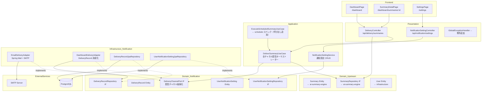
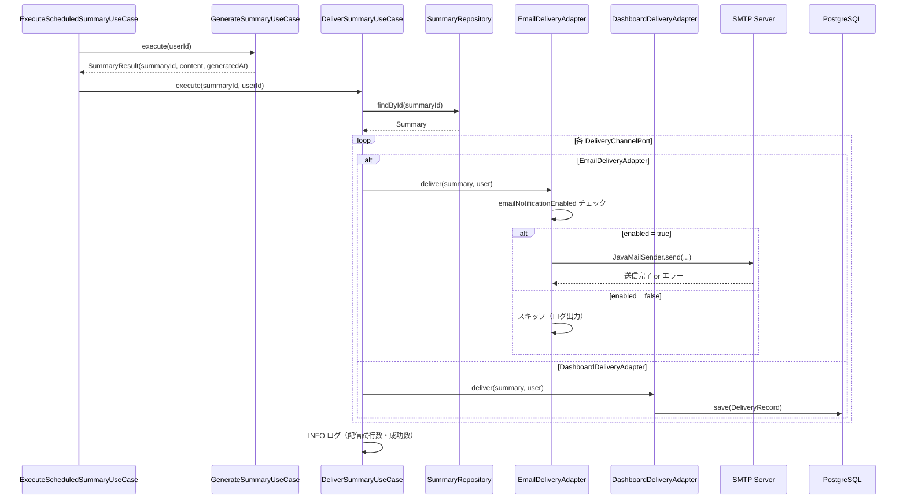
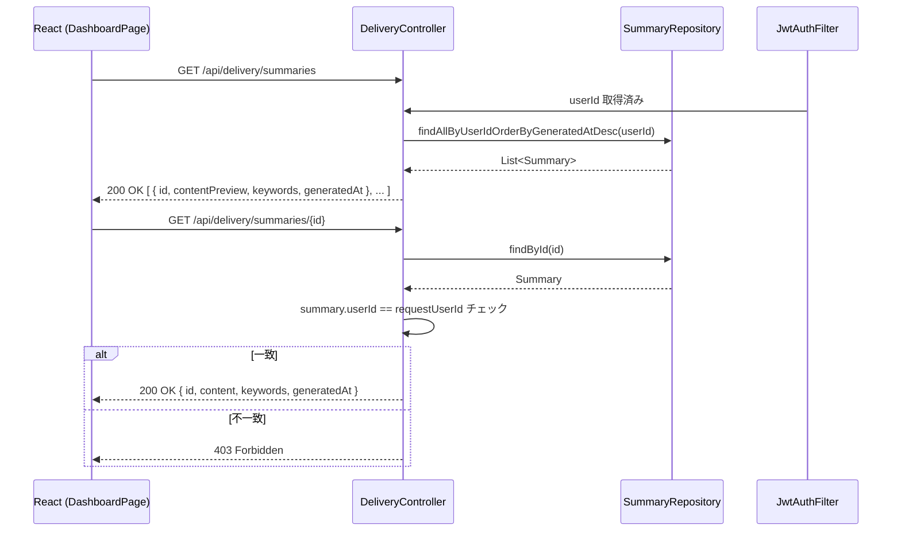

# 設計書: notification-delivery

## 概要

本スペックは、ニュース要約配信アプリケーション（News-Summary-R）の**通知配信機能**を実装する。`scheduler` スペックが生成した `Summary` エンティティを Email（Spring Mail/SMTP）と Webダッシュボード（PostgreSQL 永続化 + REST API）の2チャネルで配信し、将来の LINE/Discord 拡張を見据えた `DeliveryChannelPort` 出力ポート抽象化を確立する。

**対象ユーザー**: JWT 認証済みのアプリケーションエンドユーザー（メール受信・ダッシュボード閲覧・通知設定変更）。

**影響範囲**: `scheduler` スペックの `ExecuteScheduledSummaryUseCase` 完了後に `DeliverSummaryUseCase` を呼び出す形で統合する。新たに `DeliveryChannelPort`・`DeliverSummaryUseCase`・`EmailDeliveryAdapter`・`DashboardDeliveryAdapter`・`UserNotificationSetting`・`DeliveryRecord`・React画面 2本を DDD 4層パッケージ構造に追加する。

### ゴール

- `DeliveryChannelPort` 出力ポートインターフェースを定義し、将来の複数チャネル拡張をアダプター追加だけで対応できる設計を確立する
- `EmailDeliveryAdapter`（Spring Mail + SMTP）でユーザーへメール通知を送信する
- `DashboardDeliveryAdapter` で `DeliveryRecord` を永続化し、要約履歴 REST API を提供する
- `DeliverSummaryUseCase` で全チャネルへの配信をオーケストレーションする
- `UserNotificationSetting` エンティティで Email 通知 ON/OFF を管理する REST API を提供する
- React 画面（要約履歴一覧・詳細・設定）を実装する

### 非ゴール

- LINE/Discord アダプターの実装（インターフェース定義のみ）
- プッシュ通知（ブラウザ Push / モバイル Push）
- 配信失敗時の自動再試行
- 要約の再生成
- テストコード（プロジェクトポリシーによりスコープ外）
- DB マイグレーションツール（`ddl-auto=update` で代替）

---

## 境界コミットメント（Boundary Commitments）

### このスペックが所有するもの

- `DeliveryChannelPort` ドメイン出力ポートインターフェース（配信チャネル抽象化の境界）
- `DeliverSummaryUseCase` アプリケーションサービス（全チャネル配信オーケストレーション）
- `NotificationSettingService` アプリケーションサービス（Email 通知設定の CRUD）
- `EmailDeliveryAdapter` インフラアダプター（Spring Mail + SMTP 実装）
- `DashboardDeliveryAdapter` インフラアダプター（DeliveryRecord 永続化）
- `DeliveryRecord` ドメインエンティティ（summaryId, userId, deliveredAt, channel）と `DeliveryRecordRepository` インターフェース
- `UserNotificationSetting` ドメインエンティティ（userId, emailNotificationEnabled）と `UserNotificationSettingRepository` インターフェース
- `DeliveryController` REST API エンドポイント（要約履歴一覧・詳細）
- `NotificationSettingController` REST API エンドポイント（通知設定 GET/PUT）
- React 画面: `DashboardPage`（要約履歴一覧）・`SummaryDetailPage`（詳細）・`SettingsPage`（通知設定セクションを追加。`keyword-settings` スペックが作成したページに統合）
- `GlobalExceptionHandler` への `SummaryNotFoundException`（404）追加
- `ExecuteScheduledSummaryUseCase` への `DeliverSummaryUseCase` 呼び出し追加（scheduler スペックへの変更）

### 境界外（このスペックが所有しないもの）

- `Summary` エンティティ・`SummaryRepository`（`ai-summary-engine` スペックが所有）
- `User` エンティティ・JWT 認証フィルター・SecurityConfig（`infrastructure` スペックが所有）
- `ExecuteScheduledSummaryUseCase` の本体ロジック（`scheduler` スペックが所有。本スペックは `DeliverSummaryUseCase` の呼び出し追加のみ担当）
- メール送信サーバー・SMTP インフラの管理
- LINE/Discord アダプター実装

### 許可された依存

- `infrastructure` スペック提供: `User`（id: Long, email: String）、`JwtAuthenticationFilter`・`SecurityConfig`・`GlobalExceptionHandler`
- `ai-summary-engine` スペック提供: `Summary`（id, userId, content, keywords, generatedAt）、`SummaryRepository`
- `scheduler` スペック提供: `ExecuteScheduledSummaryUseCase`（呼び出し追加のみ）
- Spring Boot 3.x / Spring Mail / Spring Data JPA（blocking JPA のみ）
- PostgreSQL（Docker Compose 経由）

### 再検証トリガー

- `Summary` エンティティの属性・ID 型を変更した場合、本スペックの `DeliverSummaryUseCase`・`DashboardDeliveryAdapter` を再検証すること
- `User` エンティティの `email` 属性を変更した場合、`EmailDeliveryAdapter` を再検証すること
- `ExecuteScheduledSummaryUseCase` のシグネチャを変更した場合、統合箇所を再検証すること
- `DeliveryChannelPort` のインターフェースを変更した場合、全アダプター実装を再検証すること

---

## アーキテクチャ

### DDD 4層パッケージ構造への追加

```
com.newssummary
├── domain/
│   ├── user/                        # ← infrastructure スペック（変更なし）
│   ├── keyword/                     # ← keyword-settings スペック（変更なし）
│   ├── summaryconfig/               # ← keyword-settings スペック（変更なし）
│   ├── summary/                     # ← ai-summary-engine スペック（変更なし）
│   ├── scheduler/                   # ← scheduler スペック（変更なし）
│   └── notification/                # ← 本スペックで追加
│       ├── DeliveryChannelPort.kt   # 配信チャネル出力ポートIF（ドメイン層）
│       ├── DeliveryRecord.kt        # 配信記録 JPA エンティティ兼ドメインモデル
│       ├── DeliveryRecordRepository.kt     # リポジトリIF（ドメイン層）
│       ├── UserNotificationSetting.kt      # 通知設定 JPA エンティティ兼ドメインモデル
│       └── UserNotificationSettingRepository.kt  # リポジトリIF（ドメイン層）
├── application/
│   ├── auth/                        # ← infrastructure スペック（変更なし）
│   ├── keyword/                     # ← keyword-settings スペック（変更なし）
│   ├── summaryconfig/               # ← keyword-settings スペック（変更なし）
│   ├── summary/                     # ← ai-summary-engine スペック（変更なし）
│   ├── scheduler/                   # ← scheduler スペック（本スペックで DeliverSummaryUseCase 呼び出し追加）
│   └── notification/                # ← 本スペックで追加
│       ├── DeliverSummaryUseCase.kt  # 全チャネル配信オーケストレーター
│       ├── NotificationSettingService.kt  # 通知設定 CRUD ユースケース
│       └── dto/
│           ├── SummaryDeliveryResponse.kt # 要約履歴レスポンス DTO
│           └── NotificationSettingResponse.kt  # 通知設定レスポンス DTO
├── infrastructure/
│   ├── persistence/
│   │   ├── ...（既存）
│   │   ├── DeliveryRecordJpaRepository.kt         # DeliveryRecordRepository の JPA 実装
│   │   └── UserNotificationSettingJpaRepository.kt # UserNotificationSettingRepository の JPA 実装
│   ├── notification/                # ← 本スペックで追加
│   │   ├── EmailDeliveryAdapter.kt  # DeliveryChannelPort の Email 実装
│   │   └── DashboardDeliveryAdapter.kt # DeliveryChannelPort の Dashboard 実装
│   ├── ai/                          # ← ai-summary-engine スペック（変更なし）
│   ├── redis/                       # ← infrastructure スペック（変更なし）
│   ├── scheduler/                   # ← scheduler スペック（変更なし）
│   └── security/                    # ← infrastructure スペック（変更なし）
└── presentation/
    ├── AuthController.kt             # ← infrastructure スペック（変更なし）
    ├── KeywordController.kt          # ← keyword-settings スペック（変更なし）
    ├── SummaryConfigController.kt    # ← keyword-settings スペック（変更なし）
    ├── SummaryController.kt          # ← ai-summary-engine スペック（変更なし）
    ├── GlobalExceptionHandler.kt     # ← 本スペックで SummaryNotFoundException 追加
    ├── DeliveryController.kt         # ← 本スペックで追加（要約履歴 API）
    └── NotificationSettingController.kt  # ← 本スペックで追加（通知設定 API）
```

### アーキテクチャパターン・境界マップ



**依存方向**: Presentation → Application → Domain ← Infrastructure（依存性逆転を維持）

`DeliveryChannelPort` はドメイン層に定義し、`EmailDeliveryAdapter` と `DashboardDeliveryAdapter` はインフラ層で実装する。`DeliverSummaryUseCase` は `List<DeliveryChannelPort>` を受け取り、Spring が自動で全実装をインジェクトする。

### テクノロジースタック

| レイヤー | 選択 / バージョン | 役割 | 備考 |
|---------|------------------|------|------|
| フロントエンド | React 18 + Vite + Tailwind CSS 3.x | 要約履歴画面・通知設定画面 | React Router v6 |
| バックエンド | Kotlin + Spring Boot 3.x | REST API・ユースケース・アダプター | Spring Security 6.x (infra 継承) |
| メール送信 | Spring Boot Starter Mail | SMTP 経由 Email 配信 | `JavaMailSender` |
| ORM | Spring Data JPA / Hibernate | DeliveryRecord・UserNotificationSetting 永続化 | blocking JPA のみ（R2DBC 禁止）|
| データストア | PostgreSQL 15 | 配信記録・通知設定保存 | ddl-auto=update |
| コンテナ | Docker Compose v2 | 開発環境 | SMTP は MailHog 等のデバッグサーバー推奨 |

---

## ファイル構造計画

### ディレクトリ構造

```
backend/src/main/kotlin/com/newssummary/
├── domain/
│   └── notification/
│       ├── DeliveryChannelPort.kt              # 配信チャネル出力ポートIF
│       ├── DeliveryRecord.kt                   # 配信記録 JPA エンティティ
│       ├── DeliveryRecordRepository.kt         # ドメイン層リポジトリIF
│       ├── UserNotificationSetting.kt          # 通知設定 JPA エンティティ
│       └── UserNotificationSettingRepository.kt # ドメイン層リポジトリIF
├── application/
│   └── notification/
│       ├── DeliverSummaryUseCase.kt            # 全チャネル配信オーケストレーター
│       ├── NotificationSettingService.kt        # 通知設定 CRUD ユースケース
│       └── dto/
│           ├── SummaryDeliveryResponse.kt       # 要約履歴一覧・詳細レスポンス DTO
│           └── NotificationSettingResponse.kt   # 通知設定レスポンス DTO
├── infrastructure/
│   ├── persistence/
│   │   ├── DeliveryRecordJpaRepository.kt      # DeliveryRecordRepository の JPA 実装
│   │   └── UserNotificationSettingJpaRepository.kt  # UserNotificationSettingRepository の JPA 実装
│   └── notification/
│       ├── EmailDeliveryAdapter.kt             # DeliveryChannelPort の Email 実装
│       └── DashboardDeliveryAdapter.kt         # DeliveryChannelPort の Dashboard 実装
└── presentation/
    ├── DeliveryController.kt                   # /api/delivery/summaries エンドポイント
    └── NotificationSettingController.kt        # /api/notification/settings エンドポイント

backend/src/main/resources/
└── application.yml                             # spring.mail.* 設定を追記

frontend/src/
├── pages/
│   ├── DashboardPage.tsx                       # 要約履歴一覧ページ（既存スタブを実装）
│   ├── SummaryDetailPage.tsx                   # 要約詳細ページ（新規）
│   └── SettingsPage.tsx                        # 通知設定セクションを追加（keyword-settings スペックが作成済み）
├── api/
│   ├── deliveryApi.ts                          # /api/delivery/* クライアント関数
│   └── notificationSettingApi.ts               # /api/notification/* クライアント関数
└── App.tsx                                     # ルーティング追加（/dashboard/summaries/:id, /settings）
```

### 修正対象ファイル

- `backend/src/main/kotlin/com/newssummary/application/scheduler/ExecuteScheduledSummaryUseCase.kt` — `GenerateSummaryUseCase.execute(userId)` 成功後に `DeliverSummaryUseCase.execute(summaryId, userId)` を呼び出す処理を追加
- `backend/src/main/kotlin/com/newssummary/presentation/GlobalExceptionHandler.kt` — `SummaryNotFoundException`（→ 404）の例外ハンドラを追加
- `backend/src/main/resources/application.yml` — `spring.mail.*` 設定ブロックを追加
- `frontend/src/App.tsx` — `/dashboard/summaries/:id`・`/settings` ルートを追加

---

## システムフロー

### 配信フロー（スケジューラー起動）



### 要約履歴閲覧フロー



---

## 要件トレーサビリティ

| 要件 | 概要 | コンポーネント | インターフェース | フロー |
|------|------|--------------|----------------|--------|
| 1.1–1.5 | DeliveryChannelPort 出力ポート定義・ループ配信 | DeliveryChannelPort, DeliverSummaryUseCase | DeliveryChannelPort | 配信フロー |
| 2.1–2.7 | Email 配信 | EmailDeliveryAdapter | DeliveryChannelPort | 配信フロー |
| 3.1–3.7 | ダッシュボード配信・履歴 API | DashboardDeliveryAdapter, DeliveryRecord, DeliveryController | GET /api/delivery/summaries | 履歴閲覧フロー |
| 4.1–4.5 | DeliverSummaryUseCase オーケストレーション | DeliverSummaryUseCase, ExecuteScheduledSummaryUseCase | — | 配信フロー |
| 5.1–5.5 | Email 通知設定 | UserNotificationSetting, NotificationSettingService, NotificationSettingController | GET/PUT /api/notification/settings | — |
| 6.1–6.7 | 要約履歴 React 画面 | DashboardPage, SummaryDetailPage | GET /api/delivery/summaries | 履歴閲覧フロー |
| 7.1–7.5 | Email 通知設定 React 画面 | SettingsPage | GET/PUT /api/notification/settings | — |

---

## コンポーネントとインターフェース

### コンポーネントサマリー

| コンポーネント | 層 | 意図 | 要件カバレッジ | 主要依存 |
|---|---|---|---|---|
| DeliveryChannelPort | ドメイン | 配信チャネル出力ポートIF | 1.1–1.5 | — |
| DeliveryRecord | ドメイン | 配信記録エンティティ | 3.1, 3.2 | — |
| DeliveryRecordRepository | ドメイン | リポジトリIF | 3.1 | — |
| UserNotificationSetting | ドメイン | Email 通知設定エンティティ | 5.1 | — |
| UserNotificationSettingRepository | ドメイン | リポジトリIF | 5.1–5.4 | — |
| DeliverSummaryUseCase | アプリケーション | 全チャネル配信オーケストレーター | 4.1–4.5 | SummaryRepository, List<DeliveryChannelPort> |
| NotificationSettingService | アプリケーション | 通知設定 CRUD | 5.1–5.5 | UserNotificationSettingRepository |
| EmailDeliveryAdapter | インフラ/通知 | Email 配信実装 | 2.1–2.7 | JavaMailSender, UserNotificationSettingRepository |
| DashboardDeliveryAdapter | インフラ/通知 | Dashboard 配信実装（DeliveryRecord 永続化） | 3.1, 3.2 | DeliveryRecordRepository |
| DeliveryRecordJpaRepository | インフラ/永続化 | DeliveryRecordRepository JPA 実装 | 3.1 | Spring Data JPA |
| UserNotificationSettingJpaRepository | インフラ/永続化 | UserNotificationSettingRepository JPA 実装 | 5.1–5.4 | Spring Data JPA |
| DeliveryController | プレゼンテーション | 要約履歴 REST API | 3.3–3.7 | SummaryRepository |
| NotificationSettingController | プレゼンテーション | 通知設定 REST API | 5.2–5.5 | NotificationSettingService |
| DashboardPage | フロントエンド | 要約履歴一覧画面 | 6.1–6.7 | deliveryApi |
| SummaryDetailPage | フロントエンド | 要約詳細画面 | 6.3, 6.4 | deliveryApi |
| SettingsPage | フロントエンド | 既存設定画面に通知設定セクション追加 | 7.1–7.5 | notificationSettingApi |

---

### ドメイン層

#### DeliveryChannelPort インターフェース

| フィールド | 詳細 |
|---|---|
| 意図 | 配信チャネル呼び出しの出力ポートインターフェース。将来の LINE/Discord 拡張をアダプター追加のみで対応可能にする |
| 要件 | 1.1–1.5 |

**コントラクト**: Service [x]

##### サービスインターフェース

```kotlin
interface DeliveryChannelPort {
    fun deliver(summary: Summary, user: User)
}
```

- 事前条件: `summary` と `user` は非 null
- 事後条件: 各チャネル固有の配信処理が完了すること
- 例外: 配信失敗時は例外をスローし、呼び出し元 (`DeliverSummaryUseCase`) が個別に catch すること

---

#### DeliveryRecord エンティティ

| フィールド | 詳細 |
|---|---|
| 意図 | 配信記録を表す JPA エンティティ兼ドメインモデル |
| 要件 | 3.1, 3.2 |

##### ドメインモデル

```kotlin
@Entity
@Table(name = "delivery_records")
class DeliveryRecord(
    @Id @GeneratedValue(strategy = GenerationType.IDENTITY)
    val id: Long = 0,
    @Column(name = "summary_id", nullable = false)
    val summaryId: Long,
    @Column(name = "user_id", nullable = false)
    val userId: Long,
    @Column(name = "delivered_at", nullable = false)
    val deliveredAt: Instant = Instant.now(),
    @Column(nullable = false)
    val channel: String   // "EMAIL" または "DASHBOARD"
)
```

---

#### UserNotificationSetting エンティティ

| フィールド | 詳細 |
|---|---|
| 意図 | ユーザーの通知設定（Email ON/OFF）を表す JPA エンティティ兼ドメインモデル |
| 要件 | 5.1 |

##### ドメインモデル

```kotlin
@Entity
@Table(name = "user_notification_settings")
class UserNotificationSetting(
    @Id @GeneratedValue(strategy = GenerationType.IDENTITY)
    val id: Long = 0,
    @Column(name = "user_id", nullable = false, unique = true)
    val userId: Long,
    @Column(name = "email_notification_enabled", nullable = false)
    var emailNotificationEnabled: Boolean = true
)
```

#### UserNotificationSettingRepository インターフェース

```kotlin
interface UserNotificationSettingRepository {
    fun findByUserId(userId: Long): UserNotificationSetting?
    fun save(setting: UserNotificationSetting): UserNotificationSetting
}
```

#### DeliveryRecordRepository インターフェース

```kotlin
interface DeliveryRecordRepository {
    fun save(record: DeliveryRecord): DeliveryRecord
}
```

---

### アプリケーション層

#### DeliverSummaryUseCase

| フィールド | 詳細 |
|---|---|
| 意図 | `summaryId` から `Summary` を取得し、全 `DeliveryChannelPort` に配信するオーケストレーターユースケース |
| 要件 | 4.1–4.5 |

**依存**
- Inbound: ExecuteScheduledSummaryUseCase（スケジューラー起動）（P0）
- Outbound: SummaryRepository — Summary 取得（P0）
- Outbound: UserRepository — User 取得（P0）
- Outbound: List<DeliveryChannelPort> — 全チャネル配信（P0）

**コントラクト**: Service [x]

##### サービスインターフェース

```kotlin
@Service
class DeliverSummaryUseCase(
    private val summaryRepository: SummaryRepository,
    private val userRepository: UserRepository,
    private val deliveryChannels: List<DeliveryChannelPort>
) {
    fun execute(summaryId: Long, userId: Long)
}
```

- 事前条件: `summaryId` に対応する `Summary` が存在すること
- 事後条件: 全 `DeliveryChannelPort` に対して配信が試みられ、成功数がログに出力されること
- 例外: `Summary` が見つからない場合は `SummaryNotFoundException`

**実装ノート**
- `SummaryRepository.findById(summaryId)` で Summary を取得し、存在しない場合は `SummaryNotFoundException` をスロー
- `UserRepository.findById(userId)` または `findByEmail` で User を取得する（`SummaryNotFoundException` と同様に対応）
- `deliveryChannels.forEach { channel -> try { channel.deliver(summary, user) } catch (e: Exception) { errorCount++; logger.error(...) } }`
- Spring が `List<DeliveryChannelPort>` に全 `DeliveryChannelPort` 実装を自動インジェクションする

#### NotificationSettingService

| フィールド | 詳細 |
|---|---|
| 意図 | ユーザーの Email 通知設定の取得・更新ユースケース |
| 要件 | 5.1–5.5 |

**コントラクト**: Service [x]

##### サービスインターフェース

```kotlin
interface NotificationSettingServiceInterface {
    fun getSettings(userId: Long): NotificationSettingResponse
    fun updateSettings(userId: Long, emailNotificationEnabled: Boolean): NotificationSettingResponse
}

data class NotificationSettingResponse(
    val userId: Long,
    val emailNotificationEnabled: Boolean
)
```

- 事後条件（getSettings）: 設定が存在しない場合はデフォルト値（emailNotificationEnabled: true）を返す
- 事後条件（updateSettings）: 設定が存在しない場合は新規作成し、存在する場合は更新する

---

### インフラ/通知層

#### EmailDeliveryAdapter

| フィールド | 詳細 |
|---|---|
| 意図 | `DeliveryChannelPort` の Spring Mail（SMTP）実装。ユーザーへ要約メールを送信する |
| 要件 | 2.1–2.7 |

**依存**
- Outbound: JavaMailSender（Spring Boot Starter Mail）— SMTP メール送信（P0）
- Outbound: UserNotificationSettingRepository — Email 通知設定確認（P0）

**コントラクト**: Service [x]

##### サービスインターフェース

```kotlin
@Component
class EmailDeliveryAdapter(
    private val mailSender: JavaMailSender,
    private val userNotificationSettingRepository: UserNotificationSettingRepository,
    @Value("\${spring.mail.from}") private val fromAddress: String
) : DeliveryChannelPort {
    override fun deliver(summary: Summary, user: User)
}
```

**実装ノート**
- `userNotificationSettingRepository.findByUserId(user.id)?.emailNotificationEnabled ?: true` で通知設定確認
- `emailNotificationEnabled == false` の場合は `logger.info("Email notification disabled for user ${user.id}")` を出力してリターン
- `SimpleMailMessage` または `MimeMessage` を使用してメールを構築
- メール件名: `"【ニュース要約】${summary.generatedAt.atZone(ZoneId.systemDefault()).toLocalDate()}"`
- メール本文: キーワード一覧 + 要約内容
- 送信失敗時は例外をスローし、`DeliverSummaryUseCase` が catch して ERROR ログを出力する

#### DashboardDeliveryAdapter

| フィールド | 詳細 |
|---|---|
| 意図 | `DeliveryChannelPort` の Dashboard 実装。`DeliveryRecord` を PostgreSQL に保存することで配信記録を永続化する |
| 要件 | 3.1, 3.2 |

**コントラクト**: Service [x]

##### サービスインターフェース

```kotlin
@Component
class DashboardDeliveryAdapter(
    private val deliveryRecordRepository: DeliveryRecordRepository
) : DeliveryChannelPort {
    override fun deliver(summary: Summary, user: User)
}
```

**実装ノート**
- `deliveryRecordRepository.save(DeliveryRecord(summaryId = summary.id, userId = user.id, channel = "DASHBOARD"))` を呼び出す
- 保存失敗時は例外をスロー（`DeliverSummaryUseCase` が catch）

---

### プレゼンテーション層

#### DeliveryController

| フィールド | 詳細 |
|---|---|
| 意図 | 要約履歴一覧・詳細の REST エンドポイントを提供する |
| 要件 | 3.3–3.7 |

**コントラクト**: API [x]

##### API コントラクト

| メソッド | エンドポイント | リクエスト | レスポンス | エラー |
|---------|-------------|-----------|-----------|-------|
| GET | /api/delivery/summaries | — | `List<SummaryDeliveryResponse>` | 401, 500 |
| GET | /api/delivery/summaries/{id} | — | `SummaryDeliveryResponse` | 401, 403, 404, 500 |

**DTO 定義**

```kotlin
data class SummaryDeliveryResponse(
    val id: Long,
    val content: String,          // 一覧: 先頭200文字、詳細: 全文
    val keywords: String,
    val generatedAt: Instant,
    val isPreview: Boolean = false
)
```

**実装ノート**
- `@AuthenticationPrincipal` または SecurityContext から `userId` を取得
- 一覧: `summaryRepository.findAllByUserIdOrderByGeneratedAtDesc(userId)` から取得し、`content` を先頭200文字に切り詰める
- 詳細: `summaryRepository.findById(id)` または `findAllByUserIdOrderByGeneratedAtDesc` と組み合わせて `userId` の所有権チェックを実施。別ユーザーの場合は 403 を返す
- 所有権チェックのために `SummaryRepository` に `findByIdAndUserId(id: Long, userId: Long): Summary?` を追加する（または `findById` 後に `userId` を比較する）

#### NotificationSettingController

| フィールド | 詳細 |
|---|---|
| 意図 | Email 通知設定の取得・更新 REST エンドポイントを提供する |
| 要件 | 5.2–5.5 |

**コントラクト**: API [x]

##### API コントラクト

| メソッド | エンドポイント | リクエスト | レスポンス | エラー |
|---------|-------------|-----------|-----------|-------|
| GET | /api/notification/settings | — | `NotificationSettingResponse` | 401, 500 |
| PUT | /api/notification/settings | `UpdateNotificationSettingRequest` | `NotificationSettingResponse` | 400, 401, 500 |

**DTO 定義**

```kotlin
data class UpdateNotificationSettingRequest(
    @field:NotNull val emailNotificationEnabled: Boolean
)

data class NotificationSettingResponse(
    val userId: Long,
    val emailNotificationEnabled: Boolean
)
```

---

### フロントエンド層

#### DashboardPage（要約履歴一覧）

| フィールド | 詳細 |
|---|---|
| 意図 | 認証済みユーザーの要約履歴一覧を表示し、詳細ページへの遷移を提供する |
| 要件 | 6.1–6.7 |

**実装ノート**
- `useEffect` で `GET /api/delivery/summaries` を呼び出し
- ローディング中は Spinner を表示
- 0件時は「まだ要約がありません」メッセージを表示
- 各行に `generatedAt`（`YYYY/MM/DD HH:mm` 形式）・`keywords`・本文プレビュー（先頭200文字）を表示し、クリックで `/dashboard/summaries/{id}` に遷移

#### SummaryDetailPage（要約詳細）

| フィールド | 詳細 |
|---|---|
| 意図 | 指定 ID の要約全文・キーワード・生成日時を表示する |
| 要件 | 6.3, 6.4, 6.6, 6.7 |

**実装ノート**
- URL パラメーター `id` を使用して `GET /api/delivery/summaries/{id}` を呼び出し
- 403/404 エラー時はエラーメッセージを表示

#### SettingsPage（通知設定セクション追加）

| フィールド | 詳細 |
|---|---|
| 意図 | `keyword-settings` スペックが作成した `SettingsPage.tsx`（`/settings`）に Email 通知 ON/OFF トグルセクションを追加する |
| 要件 | 7.1–7.5 |

**実装ノート**
- `keyword-settings` スペックの `SettingsPage.tsx` に「通知設定」セクションを追加する（新規ファイル作成ではない）
- `useEffect` で `GET /api/notification/settings` を呼び出し、トグル初期値を設定
- トグル変更時に `PUT /api/notification/settings` を即座に呼び出し
- API 呼び出し中はトグルを `disabled` に設定
- 保存成功時は「設定を保存しました」、失敗時は「エラーが発生しました」を表示

---

## データモデル

### ドメインモデル

- **DeliveryRecord 集約**: `DeliveryRecord`（summaryId, userId, deliveredAt, channel）。一度保存されたレコードは変更されない（追記のみ）。
- **UserNotificationSetting 集約**: `UserNotificationSetting`（userId, emailNotificationEnabled）。userId に対して一意。不変条件: userId はユーザー作成後に変更されない。

### 物理データモデル

```sql
CREATE TABLE delivery_records (
    id             BIGSERIAL PRIMARY KEY,
    summary_id     BIGINT NOT NULL,
    user_id        BIGINT NOT NULL,
    delivered_at   TIMESTAMPTZ NOT NULL DEFAULT NOW(),
    channel        VARCHAR(50) NOT NULL
);

CREATE INDEX idx_delivery_records_user_id ON delivery_records(user_id);
CREATE INDEX idx_delivery_records_summary_id ON delivery_records(summary_id);

CREATE TABLE user_notification_settings (
    id                         BIGSERIAL PRIMARY KEY,
    user_id                    BIGINT NOT NULL UNIQUE,
    email_notification_enabled BOOLEAN NOT NULL DEFAULT TRUE
);

CREATE UNIQUE INDEX idx_user_notification_settings_user_id ON user_notification_settings(user_id);
```

※ `ddl-auto=update` により JPA が自動生成する。

### application.yml への追記

```yaml
spring:
  mail:
    host: ${MAIL_HOST:localhost}
    port: ${MAIL_PORT:1025}
    username: ${MAIL_USERNAME:}
    password: ${MAIL_PASSWORD:}
    from: ${MAIL_FROM:noreply@news-summary.local}
    properties:
      mail:
        smtp:
          auth: ${MAIL_SMTP_AUTH:false}
          starttls:
            enable: ${MAIL_SMTP_STARTTLS:false}
```

---

## エラーハンドリング

### エラー戦略

- `DeliverSummaryUseCase` は各チャネルの配信を個別の try-catch で保護し、1チャネルの失敗が他チャネルの配信を中断しない
- Email 送信失敗はベストエフォート（ERROR ログ出力後に継続）
- `SummaryNotFoundException` は `GlobalExceptionHandler` で 404 にマッピング
- SMTP 設定不正による起動時エラーは fail-fast で検知する

### カスタム例外クラス

```kotlin
class SummaryNotFoundException(summaryId: Long) :
    RuntimeException("Summary not found: $summaryId")
```

### エラーカテゴリとレスポンス

- **ユーザーエラー (4xx)**:
  - 認証未済 → 401（JwtAuthenticationFilter が処理）
  - 別ユーザーの要約へのアクセス → 403
  - 要約が見つからない → 404（`SummaryNotFoundException`）
  - リクエストボディ不正 → 400（`MethodArgumentNotValidException`）
- **システムエラー (5xx)**:
  - SMTP 送信失敗 → ERROR ログ出力・配信継続（HTTP レスポンスには影響しない）
  - DB 接続失敗 → 500（`GlobalExceptionHandler` が処理）

### モニタリング

- 配信完了後: `INFO "Delivery completed: attempted={N}, succeeded={M}, userId={userId}"`
- Email 送信失敗時: `ERROR "Email delivery failed for userId={userId}, summaryId={summaryId}"` + スタックトレース
- Email 通知無効スキップ時: `INFO "Email notification disabled for userId={userId}, skipped"`

---

## セキュリティ考慮事項

- SMTP 認証情報（ユーザー名・パスワード）は環境変数から注入し、コードにハードコードしない
- `DeliveryController` の全エンドポイントは JWT 認証必須（`SecurityConfig` の `permitAll` リストから除外）
- `userId` は JWT クレームから取得し、リクエストパラメーターからの取得を禁止（改ざん防止）
- `GET /api/delivery/summaries/{id}` では `summary.userId == requestUserId` を必ず確認し、他ユーザーのデータへのアクセスを拒否する
- メール本文に含まれる要約テキストは Spring Mail が適切にエンコードして送信する
