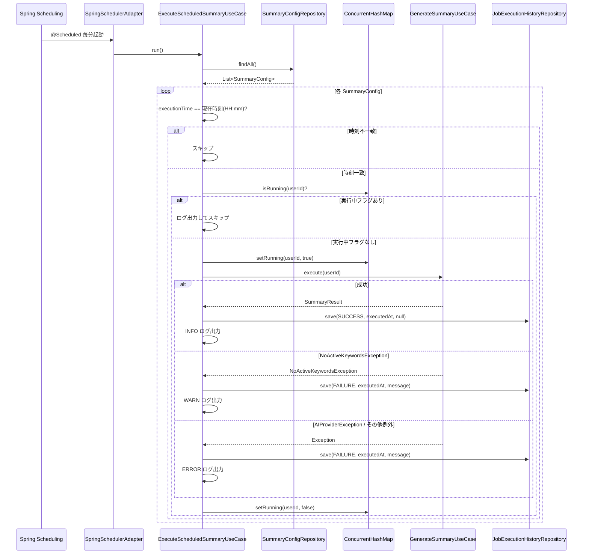

# 設計書: scheduler

## 概要

本スペックは、ニュース要約配信アプリケーション（News-Summary-R）の**スケジューラー機能**を実装する。Spring `@Scheduled` を利用して毎分起動し、`SummaryConfig.executionTime` と現在時刻が一致するユーザーの `GenerateSummaryUseCase` を自動呼び出しする。ジョブ実行結果は `JobExecutionHistory` エンティティとして PostgreSQL に永続化する。

**対象ユーザー**: アプリケーションエンドユーザー（設定時刻に自動要約生成を受ける）、システム運用者（ジョブ履歴による稼働確認）。

**影響範囲**: `ai-summary-engine` スペックが提供する `GenerateSummaryUseCase`・`SummaryConfigRepository` を上流依存とし、新たに `SchedulerPort` 抽象化・`ExecuteScheduledSummaryUseCase`・`JobExecutionHistory` 集約・`SpringSchedulerAdapter` を DDD 4層パッケージ構造に追加する。

### ゴール

- `SchedulerPort` インターフェースによる抽象化で Quartz 移行対応設計を実現する
- `SpringSchedulerAdapter` が毎分 `ExecuteScheduledSummaryUseCase.run()` を呼び出すことで自動実行を実現する
- 同一ユーザーの重複実行をインメモリフラグ（`ConcurrentHashMap`）で防止する
- `JobExecutionHistory` エンティティで成功・失敗・実行時刻・エラーメッセージを永続化する
- 個別ユーザーのジョブ失敗がスケジューラー全体を停止させないエラー耐性を実現する

### 非ゴール

- ジョブ管理 UI・Quartz への移行実装・再試行ロジック
- 通知配信（`notification-delivery` スペックの責務）
- テストコード（プロジェクトポリシーによりスコープ外）
- DB マイグレーションツール（`ddl-auto=update` で代替）

---

## 境界コミットメント（Boundary Commitments）

### このスペックが所有するもの

- `SchedulerPort` ドメインインターフェース（スケジューラー抽象化境界）
- `ExecuteScheduledSummaryUseCase` アプリケーションサービス（SummaryConfig照合→ジョブ実行→履歴記録オーケストレーター）
- `JobExecutionHistory` ドメインエンティティ（userId, status, executedAt, errorMessage）と `JobExecutionHistoryRepository` インターフェース
- `SpringSchedulerAdapter` インフラアダプター（`@Scheduled` エントリポイント・`SchedulerPort` 実装）
- `JobExecutionHistoryJpaRepository` インフラ実装
- 重複実行防止ロジック（`ConcurrentHashMap` ベースのインメモリフラグ管理）

### 境界外（このスペックが所有しないもの）

- `SummaryConfig`・`SummaryConfigRepository`（`keyword-settings` スペックが所有）
- `GenerateSummaryUseCase`（`ai-summary-engine` スペックが所有）
- `User` エンティティ・JWT 認証フィルター（`infrastructure` スペックが所有）
- 要約配信・Email 送信（`notification-delivery` スペックが担当）
- ジョブ管理 REST API・フロントエンド UI

### 許可された依存

- `infrastructure` スペック提供: `User`（id: Long）、`GlobalExceptionHandler`
- `keyword-settings` スペック提供: `SummaryConfig`、`SummaryConfigRepository`
- `ai-summary-engine` スペック提供: `GenerateSummaryUseCase`、`SummaryResult`、`NoActiveKeywordsException`、`AIProviderException`
- Spring Boot 3.x / Spring Scheduling（`@EnableScheduling`）
- Spring Data JPA（blocking JPA のみ）
- PostgreSQL（Docker Compose 経由）

### 再検証トリガー

- `SummaryConfig.executionTime` の型・フォーマットを変更した場合、本スペックの時刻照合ロジックを再検証すること
- `GenerateSummaryUseCase.execute()` の引数・戻り値・例外型を変更した場合、`ExecuteScheduledSummaryUseCase` を再検証すること
- `JobExecutionHistory` のエンティティ属性を変更した場合、`notification-delivery` はトリガー条件を再検証すること
- `JobExecutionHistoryRepository` のインターフェースを変更した場合、`notification-delivery` を再検証すること

---

## アーキテクチャ

### DDD 4層パッケージ構造への追加

本スペックは `ai-summary-engine` スペックが確立したパッケージ構造に、以下のパッケージを追加する。

```
com.newssummary
├── domain/
│   ├── user/                        # ← infrastructure スペック（変更なし）
│   ├── keyword/                     # ← keyword-settings スペック（変更なし）
│   ├── summaryconfig/               # ← keyword-settings スペック（変更なし）
│   ├── summary/                     # ← ai-summary-engine スペック（変更なし）
│   └── scheduler/                   # ← 本スペックで追加
│       ├── SchedulerPort.kt         # スケジューラー出力ポート（ドメイン層）
│       ├── JobExecutionHistory.kt   # ジョブ実行履歴エンティティ
│       └── JobExecutionHistoryRepository.kt  # リポジトリIF（ドメイン層）
├── application/
│   ├── auth/                        # ← infrastructure スペック（変更なし）
│   ├── keyword/                     # ← keyword-settings スペック（変更なし）
│   ├── summaryconfig/               # ← keyword-settings スペック（変更なし）
│   ├── summary/                     # ← ai-summary-engine スペック（変更なし）
│   └── scheduler/                   # ← 本スペックで追加
│       └── ExecuteScheduledSummaryUseCase.kt  # SummaryConfig照合→ジョブ実行→履歴記録
├── infrastructure/
│   ├── persistence/
│   │   ├── UserJpaRepository.kt          # ← infrastructure スペック（変更なし）
│   │   ├── KeywordJpaRepository.kt       # ← keyword-settings スペック（変更なし）
│   │   ├── SummaryConfigJpaRepository.kt # ← keyword-settings スペック（変更なし）
│   │   ├── SummaryJpaRepository.kt       # ← ai-summary-engine スペック（変更なし）
│   │   └── JobExecutionHistoryJpaRepository.kt  # ← 本スペックで追加
│   ├── scheduler/                        # ← 本スペックで追加
│   │   └── SpringSchedulerAdapter.kt    # @Scheduled エントリポイント・SchedulerPort実装
│   ├── ai/                           # ← ai-summary-engine スペック（変更なし）
│   ├── redis/                        # ← infrastructure スペック（変更なし）
│   └── security/                     # ← infrastructure スペック（変更なし）
└── presentation/
    ├── AuthController.kt             # ← infrastructure スペック（変更なし）
    ├── KeywordController.kt          # ← keyword-settings スペック（変更なし）
    ├── SummaryConfigController.kt    # ← keyword-settings スペック（変更なし）
    ├── SummaryController.kt          # ← ai-summary-engine スペック（変更なし）
    └── GlobalExceptionHandler.kt     # ← 本スペックでは変更なし
```

### アーキテクチャパターン・境界マップ

```mermaid
graph TB
    subgraph Infrastructure_Scheduler
        SSA[SpringSchedulerAdapter\n@Scheduled・SchedulerPort実装]
        JEHJPA[JobExecutionHistoryJpaRepository]
        InMemoryLock[ConcurrentHashMap\n重複実行防止フラグ]
    end

    subgraph Application_Scheduler
        ESSUC[ExecuteScheduledSummaryUseCase\nSummaryConfig照合→ジョブ実行→履歴記録]
    end

    subgraph Domain_Scheduler
        SP[SchedulerPort IF]
        JEH[JobExecutionHistory Entity]
        JEHR[JobExecutionHistoryRepository IF]
    end

    subgraph Upstream
        GSUC[GenerateSummaryUseCase\nai-summary-engine]
        SCR[SummaryConfigRepository\nkeyword-settings]
    end

    subgraph ExternalServices
        PG[(PostgreSQL)]
        SpringScheduling[Spring @Scheduled]
    end

    SpringScheduling --> SSA
    SSA -.implements.-> SP
    SSA --> ESSUC
    ESSUC --> SCR
    ESSUC --> GSUC
    ESSUC --> JEHR
    ESSUC --> InMemoryLock
    JEHJPA -.implements.-> JEHR
    JEHJPA --> PG
    JEH --> JEHR
```

**依存方向**: Infrastructure → Application → Domain ← Infrastructure（依存性逆転を維持）

`SchedulerPort` はドメイン層に定義し、`SpringSchedulerAdapter` はインフラ層で実装する。アプリケーション層の `ExecuteScheduledSummaryUseCase` はインフラに依存せず、`JobExecutionHistoryRepository` を通じて永続化する。

### テクノロジースタック

| レイヤー | 選択 / バージョン | 役割 | 備考 |
|---------|-----------------|------|------|
| バックエンド | Kotlin + Spring Boot 3.x | スケジューラー・ユースケース・アダプター | `@EnableScheduling` 必須 |
| スケジューリング | Spring Scheduling（`@Scheduled`） | 毎分起動エントリポイント | `fixedDelay = 60000` |
| ORM | Spring Data JPA / Hibernate | JobExecutionHistory 永続化 | blocking JPA のみ（R2DBC 禁止）|
| データストア | PostgreSQL 15 | JobExecutionHistory 保存 | ddl-auto=update |
| 重複防止 | `ConcurrentHashMap<Long, Boolean>` | インメモリ実行中フラグ | アプリ再起動でリセット（許容） |

---

## ファイル構造計画

### ディレクトリ構造

```
backend/src/main/kotlin/com/newssummary/
├── domain/
│   └── scheduler/
│       ├── SchedulerPort.kt                    # スケジューラー出力ポートIF（ドメイン層）
│       ├── JobExecutionHistory.kt              # ジョブ実行履歴 JPA エンティティ兼ドメインモデル
│       └── JobExecutionHistoryRepository.kt    # ドメイン層リポジトリIF
├── application/
│   └── scheduler/
│       └── ExecuteScheduledSummaryUseCase.kt   # SummaryConfig照合→ジョブ実行→履歴記録オーケストレーター
└── infrastructure/
    ├── persistence/
    │   └── JobExecutionHistoryJpaRepository.kt  # JobExecutionHistoryRepository の JPA 実装
    └── scheduler/
        └── SpringSchedulerAdapter.kt            # @Scheduled エントリポイント・SchedulerPort実装
```

### 修正対象ファイル

- `backend/src/main/kotlin/com/newssummary/NewsSummaryApplication.kt` — `@EnableScheduling` アノテーションを追加

---

## システムフロー

### スケジューラー実行フロー（毎分）



フローの設計ポイント:
- `executionTime` の照合は `LocalTime.now().format(HH:mm)` と文字列比較で行う（タイムゾーンはアプリデフォルト）
- 重複フラグの解除は `finally` ブロックで行い、例外発生時も必ずリセットされることを保証する
- ジョブ失敗時も次のユーザーの処理を継続する（個別 `try-catch`）

---

## 要件トレーサビリティ

| 要件 | 概要 | コンポーネント | インターフェース | フロー |
|------|------|--------------|----------------|--------|
| 1.1–1.3 | 毎分SummaryConfig照合・ジョブ実行 | SpringSchedulerAdapter, ExecuteScheduledSummaryUseCase | SchedulerPort | スケジューラー実行フロー |
| 1.4 | アプリ起動時スケジューラー有効化 | NewsSummaryApplication (@EnableScheduling) | — | — |
| 1.5 | SchedulerPort 抽象化 | SchedulerPort, SpringSchedulerAdapter | SchedulerPort | — |
| 2.1–2.3 | 重複実行防止 | ExecuteScheduledSummaryUseCase, ConcurrentHashMap | — | スケジューラー実行フロー |
| 3.1–3.5 | ジョブ履歴永続化 | JobExecutionHistory, JobExecutionHistoryRepository, JobExecutionHistoryJpaRepository | — | スケジューラー実行フロー |
| 4.1–4.4 | エラー耐性・ロギング | ExecuteScheduledSummaryUseCase | — | スケジューラー実行フロー |
| 5.1–5.4 | SchedulerPort 設計・委譲 | SchedulerPort, SpringSchedulerAdapter, ExecuteScheduledSummaryUseCase | SchedulerPort | — |

---

## コンポーネントとインターフェース

### コンポーネントサマリー

| コンポーネント | 層 | 意図 | 要件カバレッジ | 主要依存 |
|---|---|---|---|---|
| SchedulerPort | ドメイン | スケジューラー出力ポートIF | 1.5, 5.1–5.4 | — |
| JobExecutionHistory | ドメイン | ジョブ実行履歴エンティティ | 3.1–3.5 | — |
| JobExecutionHistoryRepository | ドメイン | リポジトリIF | 3.1–3.5 | — |
| ExecuteScheduledSummaryUseCase | アプリケーション | スケジュール照合・ジョブ実行・履歴記録オーケストレーター | 1.1–1.3, 2.1–2.3, 3.1–3.5, 4.1–4.4 | SummaryConfigRepository, GenerateSummaryUseCase, JobExecutionHistoryRepository |
| JobExecutionHistoryJpaRepository | インフラ/永続化 | JobExecutionHistoryRepository JPA 実装 | 3.3 | Spring Data JPA |
| SpringSchedulerAdapter | インフラ/スケジューラー | @Scheduled エントリポイント・SchedulerPort 実装 | 1.3–1.5, 5.2–5.3 | ExecuteScheduledSummaryUseCase |

---

### ドメイン層

#### SchedulerPort インターフェース

| フィールド | 詳細 |
|---|---|
| 意図 | スケジューラー呼び出しの出力ポートインターフェース。将来の Quartz 移行時にインフラ層のみの変更で対応可能にする |
| 要件 | 1.5, 5.1–5.4 |

**コントラクト**: Service [x]

##### サービスインターフェース

```kotlin
interface SchedulerPort {
    fun executeScheduledJobs()
}
```

- 事前条件: なし（毎分呼び出し）
- 事後条件: 実行時刻が一致する全ユーザーのジョブ実行が試みられ、履歴が記録される

---

#### JobExecutionHistory エンティティ

| フィールド | 詳細 |
|---|---|
| 意図 | ジョブ実行結果（成功・失敗・実行時刻・エラー内容）を記録する JPA エンティティ兼ドメインモデル |
| 要件 | 3.1–3.5 |

**責務と制約**
- 属性: `id: Long`（自動採番）、`userId: Long`（User.id への論理参照）、`status: String`（"SUCCESS" または "FAILURE"）、`executedAt: Instant`、`errorMessage: String?`（失敗時のみ）
- kotlin-jpa プラグインにより no-arg コンストラクタを自動生成（`@Entity` アノテーション）
- 一度保存されたレコードは変更されない（追記のみ）

##### ドメインモデル

```kotlin
@Entity
@Table(name = "job_execution_histories")
class JobExecutionHistory(
    @Id @GeneratedValue(strategy = GenerationType.IDENTITY)
    val id: Long = 0,
    @Column(name = "user_id", nullable = false)
    val userId: Long,
    @Column(nullable = false)
    val status: String,
    @Column(name = "executed_at", nullable = false)
    val executedAt: Instant = Instant.now(),
    @Column(name = "error_message", columnDefinition = "TEXT")
    val errorMessage: String? = null
)
```

#### JobExecutionHistoryRepository インターフェース

| フィールド | 詳細 |
|---|---|
| 意図 | ドメイン層のリポジトリインターフェース（インフラ実装への依存逆転） |
| 要件 | 3.5 |

```kotlin
interface JobExecutionHistoryRepository {
    fun save(history: JobExecutionHistory): JobExecutionHistory
}
```

---

### アプリケーション層

#### ExecuteScheduledSummaryUseCase

| フィールド | 詳細 |
|---|---|
| 意図 | 全ユーザーの `SummaryConfig` を照合し、実行時刻が一致するユーザーの `GenerateSummaryUseCase` を呼び出し、実行結果を `JobExecutionHistory` に記録するオーケストレーターユースケース |
| 要件 | 1.1–1.3, 2.1–2.3, 3.1–3.5, 4.1–4.4 |

**依存**
- Inbound: SpringSchedulerAdapter — 毎分呼び出し（P0）
- Outbound: SummaryConfigRepository（keyword-settings）— 全件取得（P0）
- Outbound: GenerateSummaryUseCase（ai-summary-engine）— 要約生成（P0）
- Outbound: JobExecutionHistoryRepository — 履歴保存（P0）
- Internal: `ConcurrentHashMap<Long, Boolean>` — 重複実行防止フラグ（P0）

**コントラクト**: Service [x]

##### サービスインターフェース

```kotlin
@Service
class ExecuteScheduledSummaryUseCase(
    private val summaryConfigRepository: SummaryConfigRepository,
    private val generateSummaryUseCase: GenerateSummaryUseCase,
    private val jobExecutionHistoryRepository: JobExecutionHistoryRepository
) {
    private val runningJobs = ConcurrentHashMap<Long, Boolean>()

    fun run()
}
```

- 事前条件: なし（毎分呼び出し）
- 事後条件: 実行時刻一致ユーザーの全ジョブが試みられ、各結果が `JobExecutionHistory` に記録される
- 例外伝播: ジョブ失敗例外は内部でキャッチして履歴記録後に次ユーザーへ継続する（外部には伝播しない）

**実装ノート**
- `SummaryConfigRepository.findAll()` で全件取得（`SummaryConfigRepository` に `findAll()` を追加する必要がある）
- 時刻照合: `LocalTime.now().format(DateTimeFormatter.ofPattern("HH:mm")) == config.executionTime`
- 重複防止: `runningJobs.putIfAbsent(userId, true) == null` が true の場合のみ実行
- finally ブロックで `runningJobs.remove(userId)` を確実に呼び出す

---

### インフラ/永続化層

#### JobExecutionHistoryJpaRepository

| フィールド | 詳細 |
|---|---|
| 意図 | `JobExecutionHistoryRepository` インターフェースの JPA 実装 |
| 要件 | 3.3 |

**実装ノート**
- `JobExecutionHistoryRepository`（ドメイン）インターフェースを実装する Spring Component
- 内部に `SpringDataJobExecutionHistoryJpaRepository`（`JpaRepository<JobExecutionHistory, Long>`）を委譲パターンで保持
- `save` はそのまま `JpaRepository.save()` に委譲

---

### インフラ/スケジューラー層

#### SpringSchedulerAdapter

| フィールド | 詳細 |
|---|---|
| 意図 | Spring `@Scheduled` による毎分起動エントリポイント。`SchedulerPort` を実装し、`ExecuteScheduledSummaryUseCase.run()` に処理を委譲する |
| 要件 | 1.3–1.5, 5.2–5.3 |

**依存**
- Inbound: Spring Scheduling Framework — `@Scheduled` トリガー（P0）
- Outbound: ExecuteScheduledSummaryUseCase — ジョブ実行委譲（P0）

**コントラクト**: Service [x]

##### サービスインターフェース

```kotlin
@Component
class SpringSchedulerAdapter(
    private val executeScheduledSummaryUseCase: ExecuteScheduledSummaryUseCase
) : SchedulerPort {

    @Scheduled(fixedDelay = 60000)
    override fun executeScheduledJobs() {
        executeScheduledSummaryUseCase.run()
    }
}
```

**実装ノート**
- `fixedDelay = 60000`（前回実行完了から60秒後に次回実行。`fixedRate` ではなく `fixedDelay` を使用し、長時間実行の重複を回避する）
- `@EnableScheduling` は `NewsSummaryApplication.kt`（メインクラス）に追加する

---

## データモデル

### ドメインモデル

- **JobExecutionHistory 集約**: `JobExecutionHistory`（userId, status, executedAt, errorMessage）。集約ルート = JobExecutionHistory。不変条件: 一度保存されたレコードは変更されない（追記のみ）。
- `notification-delivery` スペックはこの集約を読み取り専用で参照する（status="SUCCESS" をトリガーとして使用する想定）。

### 物理データモデル

```sql
CREATE TABLE job_execution_histories (
    id              BIGSERIAL PRIMARY KEY,
    user_id         BIGINT NOT NULL,
    status          VARCHAR(20) NOT NULL,
    executed_at     TIMESTAMPTZ NOT NULL DEFAULT NOW(),
    error_message   TEXT
);

CREATE INDEX idx_job_execution_histories_user_id ON job_execution_histories(user_id);
CREATE INDEX idx_job_execution_histories_executed_at ON job_execution_histories(executed_at DESC);
```

※ `ddl-auto=update` により JPA が自動生成する。

### SummaryConfigRepository への追加

`ExecuteScheduledSummaryUseCase` が全 SummaryConfig を取得するために、`keyword-settings` スペックで定義された `SummaryConfigRepository` インターフェースに以下のメソッドを追加する：

```kotlin
interface SummaryConfigRepository {
    fun save(config: SummaryConfig): SummaryConfig
    fun findByUserId(userId: Long): SummaryConfig?
    fun findAll(): List<SummaryConfig>   // ← 本スペックで追加
}
```

---

## エラーハンドリング

### エラー戦略

- 個別ユーザーのジョブ実行例外は `ExecuteScheduledSummaryUseCase` 内の `try-catch` でキャッチし、`JobExecutionHistory`（FAILURE）として記録後に次ユーザーの処理を継続する
- `SpringSchedulerAdapter` レベルでは例外をキャッチしない（Spring Scheduling が次回の `@Scheduled` 呼び出しを継続する）

### エラーカテゴリとレスポンス

- **NoActiveKeywordsException**: WARN ログ出力 → FAILURE 履歴記録 → 次ユーザーへ継続
- **AIProviderException**: ERROR ログ出力（スタックトレースあり）→ FAILURE 履歴記録 → 次ユーザーへ継続
- **その他の RuntimeException**: ERROR ログ出力（スタックトレースあり）→ FAILURE 履歴記録 → 次ユーザーへ継続
- **成功時**: INFO ログ出力（userId・generatedAt・処理時間）→ SUCCESS 履歴記録

### モニタリング

- `SpringSchedulerAdapter.executeScheduledJobs()` 開始時に DEBUG ログを出力（毎分起動確認）
- ジョブ実行後に `ExecuteScheduledSummaryUseCase.run()` 完了サマリー（実行試行数・成功数・失敗数）を INFO ログに出力

---

## セキュリティ考慮事項

- スケジューラーは内部処理のみであり、外部からの直接リクエストは受け付けない（REST エンドポイントなし）
- `userId` は `SummaryConfig` から取得し、外部入力（リクエストボディ等）には依存しない
- ジョブ履歴の取得 API は本スペックのスコープ外（`notification-delivery` または将来の管理 API スペックで定義）
